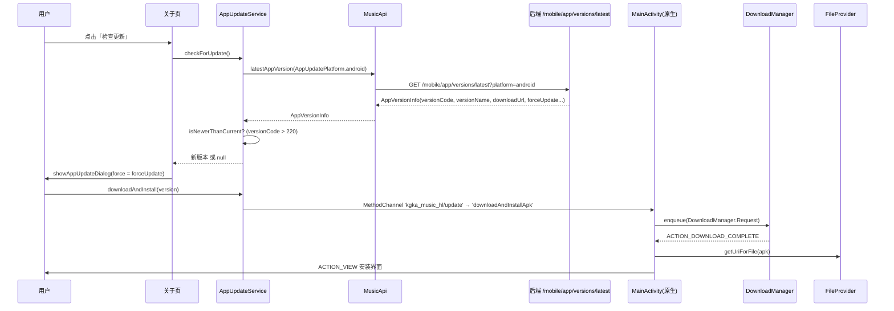

# 构建与发布流程

> 文档编号：KA-01-04
> 级别：L2 📖
> 状态：现行
> 关联代码：`lib/config/app_config.dart`（主，版本与 dart-define） + `lib/services/app_update_service.dart` + `lib/models/app_version.dart` + `lib/services/music_api.dart` + `lib/ui/widgets/app_update_widgets.dart` + `android/app/build.gradle.kts` + `android/app/src/main/AndroidManifest.xml` + `android/app/src/main/res/xml/update_file_paths.xml` + `pubspec.yaml` + `update.md`
> 最近更新：2026-09-08
> 变更触发条件：版本号规则变化、`--dart-define` 键增删、签名配置变化、ABI 策略调整、应用内更新链路（API 端点 / MethodChannel / FileProvider）任一环节改动

---

## 一句话结论（TL;DR）

1. 构建只有一条正道：`flutter build apk --release`，产物固定在 `build/app/outputs/flutter-apk/app-release.apk`（由 `android/build.gradle.kts:10-19` 把构建目录重定向到仓库根 `build/`）。
2. 版本号有**四个必须同步的落点**：`pubspec.yaml:4`、`AppConfig.appVersion`（`lib/config/app_config.dart:7`）、`AppConfig.appVersionCode`（:8）、`update.md` 的版本标题（`update.md:3`）；**当前 APK 的系统 versionCode 实际是 1，不是 220**。
3. Release 包用 **debug 密钥签名**（`android/app/build.gradle.kts:33-39`），只能内部分发，不能上架。

---

## 1. 构建命令清单

| 目的 | 命令 | 产物 / 结果 | 锚点 |
|---|---|---|---|
| 拉取依赖 | `flutter pub get` | `.dart_tool/package_config.json`、`.flutter-plugins-dependencies` | — |
| 调试运行（自动选设备） | `flutter run` | 热重载会话 | `README.md:187` |
| 调试运行（指定平台） | `flutter run -d windows` / `-d android` / `-d chrome` … | 同上 | `README.md:188-193` |
| Debug APK | `flutter build apk --debug` | `build/app/outputs/flutter-apk/app-debug.apk` | `KA-Music-项目状态.md` §5 |
| Release APK | `flutter build apk --release` | `build/app/outputs/flutter-apk/app-release.apk`（实测 61 543 537 字节） | 实测 |
| Release AAB | `flutter build appbundle --release` | `build/app/outputs/bundle/release/` | 未实测，**待核实** |
| 仅构建 arm64 | `flutter build apk --release --target-platform android-arm64` | 单 ABI APK | 见 §7 K-02 |
| 分 ABI 打包 | `flutter build apk --release --split-per-abi` | 每个 ABI 一个 APK（文件名由 Flutter 工具生成） | 见 §7 K-02 |
| 单元测试 | `flutter test` | `test/` 下 7 个文件 | `test/` |
| 静态分析 | `flutter analyze` | 基于 `analysis_options.yaml` | `analysis_options.yaml:1` |
| 清理 | `flutter clean` | 删除 `build/` 与 `.dart_tool/` | — |
| 安装到设备 | `adb install -r build/app/outputs/flutter-apk/app-release.apk` | 覆盖安装 | `KA-Music-项目状态.md` §5 |

### 1.1 构建产物路径对照

| 路径 | 内容 | 证据 |
|---|---|---|
| `build/app/outputs/flutter-apk/app-release.apk` | Flutter 标准输出 APK | 实测存在 |
| `build/app/outputs/apk/release/app-release.apk` | Gradle/AGP 原始输出 APK | 实测存在 |
| `build/app/outputs/apk/release/output-metadata.json` | `applicationId`、`versionCode`、`versionName` | 实测（见 §4） |
| `build/app/outputs/mapping/release/` | R8 混淆映射（`mapping.txt`、`seeds.txt`、`usage.txt`） | 实测存在 |
| `build/app/outputs/native-debug-symbols/release/native-debug-symbols.zip` | 原生符号表 | 实测存在 |
| `build/app/intermediates/` | 中间产物（合并清单、jniLibs 等） | 实测存在 |

---

## 2. 编译期环境变量（`--dart-define`）

| 变量 | 类型 | 默认值 | 读取位置 | 作用 |
|---|---|---|---|---|
| `KA_MUSIC_API_BASE_URL` | String | `https://music.api.hoilai.cn` | `lib/config/app_config.dart:14-17`（`AppConfig.apiBaseUrl`） | 编译期默认 API 根地址 |
| `KA_MUSIC_DEBUG_LYRICS` | bool | `true` | `lib/config/app_config.dart:19-22`（`AppConfig.debugLyrics`） | 是否输出歌词调试日志；仅在 `kDebugMode` 下真正生效（`lib/services/music_api.dart:1709,1716,1724`） |

| 用法 | 命令 |
|---|---|
| 覆盖 API 地址 | `flutter run --dart-define=KA_MUSIC_API_BASE_URL=https://your-api.com` |
| 关闭歌词调试日志 | `flutter build apk --release --dart-define=KA_MUSIC_DEBUG_LYRICS=false` |
| 组合 | `flutter build apk --release --dart-define=KA_MUSIC_API_BASE_URL=https://your-api.com --dart-define=KA_MUSIC_DEBUG_LYRICS=false` |

### 2.1 运行时覆盖（与编译期变量的关系）

| 项 | 说明 | 锚点 |
|---|---|---|
| 持久化键 | `settings.custom_api_base_url` | `lib/config/app_config.dart:12` |
| 生效规则 | 自定义值优先于编译期 `apiBaseUrl`（`effectiveBaseUrl`） | `lib/config/app_config.dart:53` |
| 视为「无自定义」的地址 | `https://music.api.hoilai.com`（旧默认域名） | `lib/config/app_config.dart:11,71,88` |
| 保存时清空的条件 | 空串 / 与编译期默认相同 / 属于旧默认域名 | `lib/config/app_config.dart:82-95` |

---

## 3. 签名配置现状

| 项 | 现状 | 锚点 |
|---|---|---|
| Release 签名 | `signingConfig = signingConfigs.getByName("debug")` | `android/app/build.gradle.kts:37` |
| 代码内注释 | 「Signing with the debug keys for now, so `flutter run --release` works.」 | `android/app/build.gradle.kts:34-36` |
| `key.properties` | 不存在，且被忽略 | `android/.gitignore:12` |
| keystore 文件 | ⚠️ **`buildKey.keystore` 已被 Git 跟踪**（`git ls-files` 实测，位于仓库根目录）；`android/.gitignore:13-14` 只忽略 `android/` 下的 keystore，对根目录无效 | `git ls-files`、`android/.gitignore:13-14`、TD-31 |
| 后果 | 可 `adb install -r` 覆盖安装；**不能上架应用商店**，也无法与正式密钥签名的包互相覆盖 | — |
| 迁移路径 | 新增 `key.properties` + `signingConfigs.release`，并把 `android/app/build.gradle.kts:37` 换成 release 配置 | 见 §6 待办 |

---

## 4. 版本号四处同步点

| # | 落点 | 当前值 | 锚点 | 谁读取它 |
|---|---|---|---|---|
| 1 | `pubspec.yaml` 的 `version:` | `2.2.0`（**无 `+build` 号**） | `pubspec.yaml:4` | Flutter 工具 → 写入 `android/local.properties` 的 `flutter.versionName` |
| 2 | `AppConfig.appVersion` | `'2.2.0'` | `lib/config/app_config.dart:7` | 关于页展示（`lib/ui/pages/about_page.dart:89,135`）、更新日志「当前版本」判定（`about_page.dart:370`） |
| 3 | `AppConfig.appVersionCode` | `'220'` | `lib/config/app_config.dart:8` | 应用内更新版本比较（`lib/models/app_version.dart:36`） |
| 4 | `update.md` 的版本标题 | `## v2.2.0` | `update.md:3` | 关于页更新日志解析，比较式 `version.version == 'v${AppConfig.appVersion}'`（`about_page.dart:370`） |

### 4.1 为什么「APK 的 versionCode 不是 220」

| 环节 | 事实 | 锚点 |
|---|---|---|
| `pubspec.yaml` 未写 `+220` | `version: 2.2.0` | `pubspec.yaml:4` |
| Flutter 从 `version` 的 `+N` 取 buildNumber，无 `+` 则返回 null | `buildNumber` getter | `flutter_manifest.dart:200-208` |
| 无 buildNumber 时不写 `flutter.versionCode` | `changeIfNecessary('flutter.versionCode', buildNumber)` | `gradle_utils.dart:1186-1191` |
| Gradle 侧缺省值 `"1"` | `getProperty("flutter.versionCode", "1")` | `FlutterPlugin.kt:132` |
| `android/app/build.gradle.kts` 直接取该扩展值 | `versionCode = flutter.versionCode` | `android/app/build.gradle.kts:26` |
| 实测产物 | `android:versionCode="1"`、`android:versionName="2.2.0"` | `build/app/intermediates/packaged_manifests/release/processReleaseManifestForPackage/AndroidManifest.xml:4-5` |
| 实测元数据 | `"versionCode": 1`、`"versionName": "2.2.0"` | `build/app/outputs/apk/release/output-metadata.json:14-15` |
| `local.properties` 现状 | 有 `flutter.versionName=2.2.0`，**无 `flutter.versionCode`** | `android/local.properties:3-4` |

**正确改法**：把 `pubspec.yaml:4` 写成 `version: 2.2.0+220`，让 Flutter 生成 `flutter.versionCode=220`，与 `AppConfig.appVersionCode` 对齐。

---

## 5. 应用内更新链路

### 5.1 端到端时序

### 5.2 逐环节对照表

| # | 环节 | 实现 | 锚点 |
|---|---|---|---|
| 1 | 入口 | 关于页「检查更新」按钮（仅 Android 显示） | `lib/ui/pages/about_page.dart:108-116` |
| 2 | 平台判定 | `isSupportedPlatform`：非 Web 且 `defaultTargetPlatform == android` | `lib/services/app_update_service.dart:14-16` |
| 3 | 手动检查 | `checkAppUpdateManually()`：Toast → 检查 → 无更新提示 / 弹窗 / 失败提示 | `lib/ui/widgets/app_update_widgets.dart:72-106` |
| 4 | 版本检查 | `checkForUpdate()`：请求最新版本，不新则返回 `null` | `lib/services/app_update_service.dart:18-28` |
| 5 | API 端点 | `GET /mobile/app/versions/latest`，参数 `platform` | `lib/services/music_api.dart:300-307` |
| 6 | 平台枚举 | `android` / `ios` / `hm`（`apiValue`） | `lib/models/app_version.dart:4-12` |
| 7 | 版本比较 | `versionCode > normalizedVersionCode(AppConfig.appVersionCode)`，即 `> 220` | `lib/models/app_version.dart:35-38,53-66` |
| 8 | 响应字段 | `platform`、`versionName`、`versionCode`、`updateContent`、`downloadUrl`、`forceUpdate`、`releaseDate` | `lib/models/app_version.dart:40-50` |
| 9 | 强制更新 | `forceUpdate` 为真时 `barrierDismissible: false`、`canPop: false`、隐藏「以后再说」 | `lib/ui/widgets/app_update_widgets.dart:116,136-137,152-156` |
| 10 | 触发下载 | `MethodChannel('kgka_music_hl/update')` → `downloadAndInstallApk` | `lib/services/app_update_service.dart:10,38-41` |
| 11 | APK 文件名 | `ka_music_` 加清洗后的 versionName 再加 `.apk`；非法字符替换为 `_`，清洗后为空则用 `latest` | `lib/services/app_update_service.dart:44-51` |
| 12 | 原生校验 | `url` 为空返回 `invalid_url`；异常返回 `download_failed` | `MainActivity.kt:91-106` |
| 13 | 下载实现 | `DownloadManager.Request`：标题「KA Music 更新包」、MIME `application/vnd.android.package-archive`、允许计费网络与漫游、下载完成可见通知、落盘到外部私有下载目录 | `MainActivity.kt:403-417` |
| 14 | 完成回调 | 注册 `ACTION_DOWNLOAD_COMPLETE` 接收器（API 33+ 用 `RECEIVER_NOT_EXPORTED`） | `MainActivity.kt:419-431` |
| 15 | 成功判定 | 查 `DownloadManager.COLUMN_STATUS == STATUS_SUCCESSFUL` | `MainActivity.kt:433-446` |
| 16 | 未知来源授权 | Android 8.0+ 若 `canRequestPackageInstalls()` 为假，跳转「安装未知应用」设置页 | `MainActivity.kt:454-464` |
| 17 | FileProvider | `FileProvider.getUriForFile(this, "\$packageName.fileprovider", apkFile)` | `MainActivity.kt:466-470` |
| 18 | 安装 Intent | `ACTION_VIEW` + MIME `application/vnd.android.package-archive` + `FLAG_GRANT_READ_URI_PERMISSION` | `MainActivity.kt:471-475` |
| 19 | authority 声明 | `\${applicationId}.fileprovider` → `com.hoilai.mm.music.fileprovider` | `android/app/src/main/AndroidManifest.xml:64-68` |
| 20 | 可共享路径 | XML 元素 `external-files-path`，属性 `name="ka_music_updates"`、`path="Download/"` | `android/app/src/main/res/xml/update_file_paths.xml:3-5` |
| 21 | 相关权限 | `REQUEST_INSTALL_PACKAGES`、`SYSTEM_ALERT_WINDOW`（后者供桌面歌词） | `android/app/src/main/AndroidManifest.xml:8-9` |

> 应用内更新**仅 Android 可用**；`AppUpdateService.isSupportedPlatform` 在 iOS/桌面/Web 上返回 `false`，关于页会显示禁用按钮「暂不支持检查更新」（`about_page.dart:117-121`）。

---

## 6. 可执行发布步骤清单

> 前提：在 `master` 分支、工作区干净、`flutter doctor` 无红项（Chrome 除外）、`JAVA_HOME` 指向 JDK 21。

| 步骤 | 操作 | 命令 / 动作 | 验收标准 |
|---|---|---|---|
| 1 | 确认分支与工作区 | `git status`、`git branch --show-current` | 分支为 `master`，无未提交改动 |
| 2 | 改版本号（四处） | `pubspec.yaml:4` → `version: X.Y.Z+NNN`；`lib/config/app_config.dart:7` → `appVersion`；`:8` → `appVersionCode`；`update.md` 顶部新增 `## vX.Y.Z` | 四处版本号一致，`+NNN` 与 `appVersionCode` 相同 |
| 3 | 更新更新日志 | 在 `update.md` 顶部追加本次变更条目 | 关于页能正确高亮「当前版本」 |
| 4 | 拉依赖 | `flutter pub get` | 无解析冲突 |
| 5 | 静态分析 | `flutter analyze` | 无 error |
| 6 | 跑测试 | `flutter test` | `test/` 7 个文件全绿 |
| 7 | 构建 Release | `flutter build apk --release`（如需单 ABI：`--target-platform android-arm64`） | 产出 `build/app/outputs/flutter-apk/app-release.apk` |
| 8 | 校验产物版本 | 查看 `build/app/outputs/apk/release/output-metadata.json` | `versionCode` = NNN，`versionName` = X.Y.Z |
| 9 | 校验 ABI | 列出 APK 内 `lib/*` 条目 | 与预期 ABI 集合一致（注意 §7 K-02） |
| 10 | 真机验证 | `adb install -r build/app/outputs/flutter-apk/app-release.apk` | 安装成功且可覆盖旧版本 |
| 11 | 冒烟测试 | 启动、登录、搜索、播放、歌词、下载、检查更新 | 主链路无阻断 |
| 12 | 打标签 | `git tag vX.Y.Z` | 标签名与 `AppConfig.appVersion` 一致 |
| 13 | 提交并推送 | `git add -A && git commit -m "publish: X.Y.Z" && git push origin master --tags` | 远程 `origin/master` 更新 |
| 14 | 发布更新包 | 把 APK 上传到后端 `/mobile/app/versions/latest` 的数据源，填 `versionCode`/`versionName`/`downloadUrl`/`forceUpdate` | 旧版本设备能检测到更新（**后端配置方式待核实**） |
| 15 | 回写文档 | 更新 `../07-推进计划/里程碑与版本路线图.md` 与 `update.md` | 文档与代码同提交 |

---

## 7. 约束与坑

| 编号 | 约束 / 坑 | 证据 | 影响 |
|---|---|---|---|
| K-01 | **APK 系统 versionCode = 1**，而 `AppConfig.appVersionCode = '220'`。应用内更新比较用的是 220，Android 系统看到的是 1。 | `build/app/intermediates/packaged_manifests/release/.../AndroidManifest.xml:4`、`output-metadata.json:14`、`lib/config/app_config.dart:8` | 覆盖安装靠签名一致；系统侧版本序列失真；上架时会被商店按 1 处理 |
| K-02 | `abiFilters += listOf("arm64-v8a")`（`android/app/build.gradle.kts:28-30`）未在实测产物中生效：release APK 内含 `arm64-v8a`、`armeabi-v7a`、`x86_64` 三套 `.so`，体积 61 543 537 字节。原因待核实。 | 对 `app-release.apk` 的 zip 列表 | 包体偏大；如确需单 ABI 必须在命令侧限定 |
| K-03 | Release 使用 **debug 签名**（`android/app/build.gradle.kts:37`），且 **`buildKey.keystore` 已入库**（`git ls-files` 实测）。 | `android/app/build.gradle.kts:33-39`、`android/.gitignore:12-14` | 不能上架、不能与正式签名包互覆盖；换签名会导致用户必须卸载重装 |
| K-04 | `KA_MUSIC_DEBUG_LYRICS` 默认 `true`（`lib/config/app_config.dart:19-22`），但日志调用被 `kDebugMode` 二次拦截（`lib/services/music_api.dart:1709`）。 | 同上 | Release 包即使不传该参数也不会打日志；不要用它做线上开关 |
| K-05 | 现有 Git 标签为 `v1.6.0`、`v2.0.5`、`v2.3.0`、`v2.5.0`，其中 `v2.3.0`（2026-07-09）、`v2.5.0`（2026-07-28）**在 `update.md` 中没有任何条目**，且当前版本号为 2.2.0。 | `git for-each-ref refs/tags`、`update.md` 全文、`pubspec.yaml:4` | 版本历史不可信；发布纪律需明确「标签 = 应用版本」 |
| K-06 | 应用内更新入口**只有关于页一个手动按钮**，`main.dart` 中没有启动检查；`AppUpdateBanner` 组件已定义但全项目无实例化。 | `lib/ui/pages/about_page.dart:108`、`lib/services/music_api.dart` 无引用、`lib/ui/widgets/app_update_widgets.dart:8-70` | 用户不主动点就永远收不到更新；`AppUpdateBanner` 属于未使用代码 |
| K-07 | `checkForUpdate` 依赖后端 `versionCode`，而后端比较基线是 `AppConfig.appVersionCode`（220），不是 APK 的 1。后端若按 APK 的 1 配置版本号，会永远判定「已是最新」。 | `lib/models/app_version.dart:35-38` | 后端配置必须以 220 为基线 |
| K-08 | 构建目录被重定向到仓库根 `build/`（`android/build.gradle.kts:10-19`），`flutter clean` 会一并删除，但 `.gitignore:33` 已忽略该目录。 | `android/build.gradle.kts:10-19`、`.gitignore:33` | 清理后需重新 `flutter pub get` |
| K-09 | `.gitattributes` 对 `*.png`、`*.jar`、`*.pbxproj`、`*.ico`、`*.metadata` 启用 **Git LFS**；克隆后若未安装 LFS，图标/启动图与 `gradle-wrapper.jar` 会变成指针文件，直接导致构建失败。 | `.gitattributes:2-6` | 新机器必须先 `git lfs install` |

---

## 8. 待办与关联

| 类型 | 内容 | 去向 |
|---|---|---|
| 待办 | 把 `pubspec.yaml:4` 改为 `2.2.0+220`，使 APK versionCode 与 `AppConfig.appVersionCode` 对齐 | `06-质量保障/已知问题与技术债台账.md` |
| 待办 | 引入 `key.properties` + release 签名配置，替换 `android/app/build.gradle.kts:37` | `08-工程纪律/分支与发布纪律.md` |
| 待办 | 澄清 `abiFilters` 失效原因，确定「单 ABI」还是「多 ABI」策略 | `06-质量保障/已知问题与技术债台账.md` |
| 待办 | 清理/对齐 Git 标签与 `update.md` 版本历史 | `07-推进计划/里程碑与版本路线图.md` |
| 待办 | 决定是否增加启动时自动检查更新，并处理 `AppUpdateBanner` 的归宿 | `07-推进计划/任务分解-WBS.md` |
| 待核实 | 后端 `/mobile/app/versions/latest` 的数据来源与版本号配置方式 | `04-数据与接口/API-端点清单.md` |
| 待核实 | `flutter build appbundle` 与 `--split-per-abi` 在本项目的实际产物名（本次未执行） | 本文档下次更新 |
| 关联 | 环境与工具链版本 → `环境与工具链.md` | 同目录 |
| 关联 | 依赖与插件 → `技术栈与依赖清单.md` | 同目录 |
| 关联 | 发布检查清单模板 → `../09-模板/发布检查清单.md` | 跨目录 |
| 关联 | Android 原生更新实现细节 → `../05-平台与原生/Android-原生集成.md` | 跨目录 |
