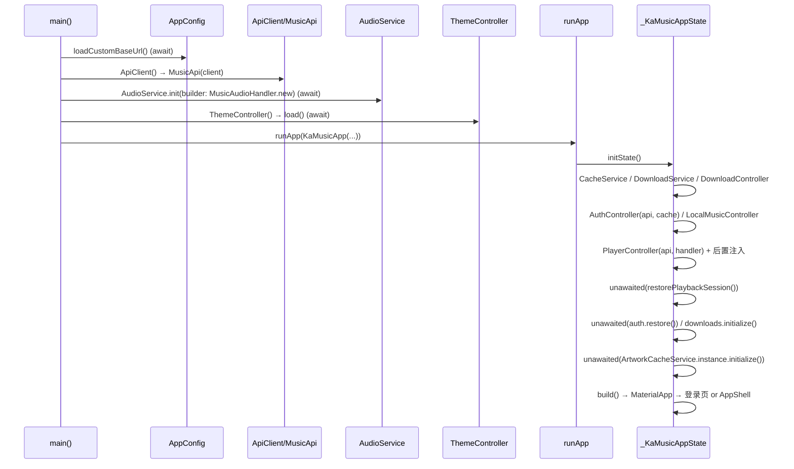

> 文档编号：KA-02-02
> 级别：L2 📖
> 状态：现行
> 关联代码：lib/main.dart（309 行）、lib/config/app_config.dart、lib/services/music_audio_handler.dart、lib/controllers/*
> 最近更新：2026-09-08
> 变更触发条件：启动顺序、依赖装配、全局 Widget 包装层发生变化时

# 启动流程与依赖装配

## TL;DR

启动分两段：**`main()` 内的同步装配**（配置恢复 → HTTP 客户端 → API → 音频处理器 → 主题）与 **`initState()` 内的异步装配**（缓存/下载/认证/播放/本地音乐控制器 + 缓存初始化）。播放会话恢复、认证恢复、下载索引加载、缩略图缓存扫描都是 `unawaited` 的**非阻塞后台任务**，不阻塞首帧。

---

## 1. 启动时序



### 1.1 阶段一：`main()`（`lib/main.dart:25-50`）

| 顺序 | 操作 | 是否阻塞 | 说明 |
|---|---|---|---|
| 1 | `WidgetsFlutterBinding.ensureInitialized()` | ✅ | Flutter 引擎绑定 |
| 2 | `AppConfig.loadCustomBaseUrl()` | ✅ | 恢复用户自定义 API 地址，**必须在创建 `ApiClient` 前**，否则首个请求会打到默认地址 |
| 3 | `ApiClient()` | ✅ | 唯一 HTTP 客户端实例 |
| 4 | `MusicApi(client)` | ✅ | 注入客户端 |
| 5 | `AudioService.init(...)` | ✅ | 创建 `MusicAudioHandler`，注册通知渠道 `kgka_music_hl.playback`，`androidStopForegroundOnPause: false` |
| 6 | `ThemeController()` + `load()` | ✅ | 读取主题设置，避免首帧闪烁 |
| 7 | `runApp(KaMusicApp(...))` | ✅ | 进入 Widget 树 |

### 1.2 阶段二：`initState()`（`lib/main.dart:88-115`）

| 顺序 | 操作 | 阻塞 | 说明 |
|---|---|---|---|
| 1 | `CacheService()` | ❌ | 无状态服务，构造即用 |
| 2 | `DownloadService()` | ❌ | 同上 |
| 3 | `DownloadController(downloadService, api)` | ❌ | 内部异步加载索引 |
| 4 | `AuthController(api, cacheService)` | ❌ | `restore()` 异步 |
| 5 | `LocalMusicController()` | ❌ | 惰性扫描 |
| 6 | `PlayerController(api, audioHandler)` | ❌ | 构造时订阅 7 个音频流 |
| 7 | `..downloadController = downloads` | — | **后置注入**，解决循环依赖 |
| 8 | `..cacheService = cacheService` | — | 后置注入 |
| 9 | `unawaited(_player.restorePlaybackSession())` | ❌ | 恢复上次队列与当前曲（不自动播放） |
| 10 | `_auth.restore()` | ❌ | 恢复登录态 |
| 11 | `_downloads.initialize()` | ❌ | 加载下载索引与播放缓存索引 |
| 12 | `unawaited(ArtworkCacheService.instance.initialize())` | ❌ | 读取上限 + 扫描目录 + 按 LRU 淘汰 |

> ⚠️ **顺序约束**：第 9 步的 `restorePlaybackSession()` 依赖第 8 步注入的 `cacheService`；若把注入写到 `restore` 之后，恢复会静默失败（`lib/controllers/player_controller.dart:1353-1354` 直接返回）。

### 1.3 阶段三：`build()`（`lib/main.dart:129-156`）

| 层级 | Widget | 作用 |
|---|---|---|
| 1 | `AnimatedBuilder(animation: _theme)` | 主题变更重建整棵树 |
| 2 | `MaterialApp` | `themeMode: ThemeMode.system`、`navigatorKey: Toast.navigatorKey` |
| 3 | `builder: _AppBackground` | 自定义背景图 + 遮罩层 |
| 4 | `_SystemUiOverlay` | 状态栏/导航栏样式（`AnnotatedRegion`） |
| 5 | `home: AnimatedBuilder(animation: _auth)` | 登录态变化切换首页 |
| 6 | `LoginPage` 或 `AppShell` | `!_auth.isRestoring && !_auth.isLoggedIn` → 登录页 |

---

## 2. 依赖装配图

```
                    ┌──────────────┐
                    │  AppConfig   │（静态，全局）
                    └──────┬───────┘
                           │
                    ┌──────▼───────┐
                    │  ApiClient   │（1 个实例）
                    └──────┬───────┘
                           │
                    ┌──────▼───────┐
                    │   MusicApi   │
                    └───┬──┬───┬───┘
        ┌───────────────┘  │   └────────────────┐
        │                  │                    │
┌───────▼──────┐  ┌────────▼────────┐  ┌────────▼────────┐
│ AuthController│  │DownloadController│  │ PlayerController│
└───────┬──────┘  └────────┬────────┘  └────────┬────────┘
        │                  │                    │
        │           ┌──────▼───────┐    ┌───────▼─────────┐
        │           │DownloadService│   │MusicAudioHandler │
        │           └──────────────┘    └─────────────────┘
        │                                │ 内部持有 5 个 Service：
        │                                │ AudioEffects / DesktopLyrics /
        │                                │ PlaybackHistory / PlaybackStats /
        │                                │ VolumeNormalization
        │
┌───────▼────────┐        ┌──────────────────┐
│  CacheService  │◀───────│ ThemeController  │
└────────────────┘        └──────────────────┘
        ▲
        │（后置注入）
┌───────┴────────────┐
│ PlayerController   │
└────────────────────┘

单例：ArtworkCacheService.instance（静态，不经 main.dart 注入）
```

---

## 3. 生命周期处理

| 事件 | 处理 | 位置 |
|---|---|---|
| `AppLifecycleState.resumed` | `_player.setAppForeground(true)` | `lib/main.dart:120` |
| `inactive / paused / detached / hidden` | `setAppForeground(false)` + `unawaited(flushPersistence())` | `lib/main.dart:122-127` |
| `dispose()` | 依次 dispose auth/player/downloads/localMusic/downloadService，关闭 `ApiClient` | `lib/main.dart:118-128` |

> ⚠️ `_cacheService` 与 `_theme` 在 `dispose()` 中未显式释放（`CacheService` 无资源，`ThemeController` 由外部传入，可接受）。

---

## 4. 约束与坑

1. **`AudioService.init` 在 `runApp` 之前 `await`**：任何在此之前的阻塞（如网络）都会拉长白屏时间。
2. **后置注入依赖顺序**：`downloadController` / `cacheService` 必须在调用依赖它们的方法之前赋值，目前靠 `initState` 的书写顺序保证，**没有编译期保护**。
3. **`restorePlaybackSession` 与 `_restoreSettings` 存在竞争**：代码注释明确说明「直接读偏好，避免与 `_restoreSettings` 的异步加载产生先后竞争」（`player_controller.dart:1350`）——这是一个已被规避的隐患，修改时勿破坏。
4. **`ArtworkCacheService.instance` 绕过 DI**：无法在测试中替换。
5. **`ThemeController` 在 `main()` 中创建但在 `_KaMusicAppState` 中重新引用**（`_theme = widget.themeController`），存在两处持有同一实例的写法。
6. **启动期无错误上报**：`unawaited` 的任务若抛异常会被静默吞掉（如 `restorePlaybackSession` 内部 `catch (_) {}`）。

---

## 5. 待办与关联

| 事项 | 文档 |
|---|---|
| 装配点重构（`main.dart` 拆分） | `07-推进计划/任务分解-WBS.md` T-M2-06 |
| 引入 DI 容器 / 构造注入 | T-M2-05 |
| 启动耗时基线 | `06-质量保障/性能与稳定性基线.md` |
| 启动期异常上报 | T-M1-03 |
| 状态与数据流 | `02-架构设计/状态管理与数据流.md` |
