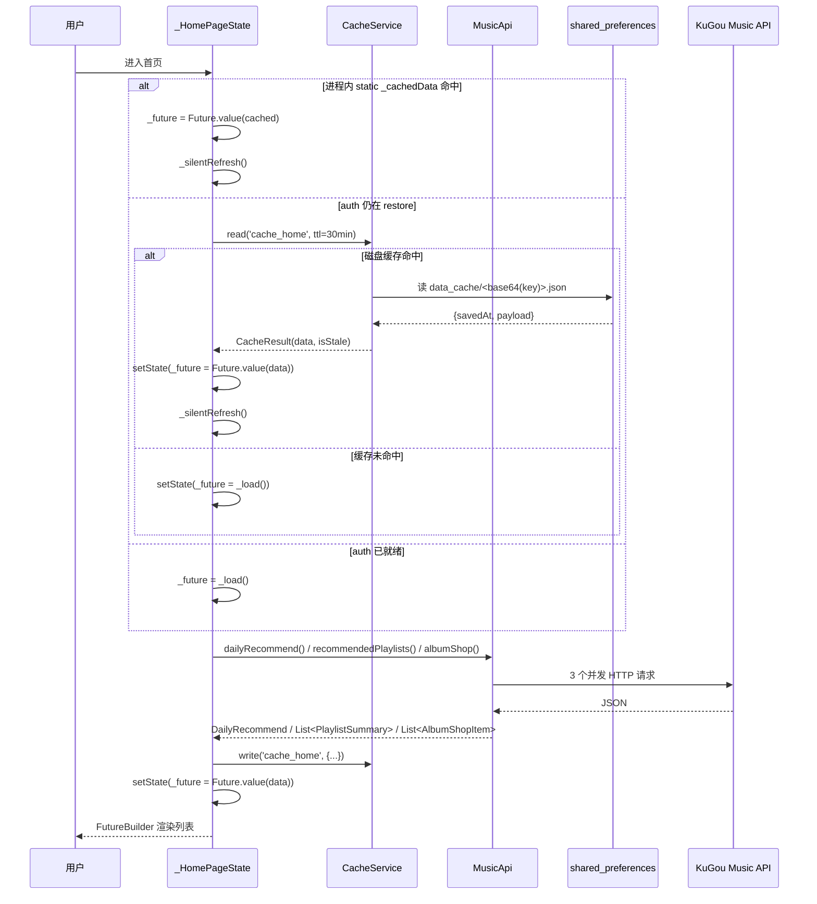

> 文档编号：KA-02-03
> 级别：L2 📖
> 状态：现行
> 关联代码：lib/main.dart（主） + lib/controllers/player_controller.dart、lib/controllers/auth_controller.dart、lib/controllers/download_controller.dart、lib/controllers/theme_controller.dart、lib/controllers/local_music_controller.dart、lib/services/cache_service.dart、lib/ui/pages/*、lib/ui/widgets/*
> 最近更新：2026-09-26
> 变更触发条件：新增/删除 `ChangeNotifier` 子类、改变控制器与页面的监听关系、改动首页或播放的缓存命中路径、引入第三方状态管理库时

# 状态管理与数据流

## TL;DR

项目**没有第三方状态管理库**：全局状态全部由 5 个 `ChangeNotifier`（`PlayerController` / `AuthController` / `DownloadController` / `ThemeController` / `LocalMusicController`）持有，在 `lib/main.dart:89-118` 手工装配，UI 用 `AnimatedBuilder` 订阅（`lib/` 共 39 处 `AnimatedBuilder`，其中 `lib/main.dart` 3 处、`lib/ui/` 36 处）。页面私有状态用 `StatefulWidget` + `setState`；高频播放进度走独立 `ValueNotifier`（`player.positionListenable`）旁路，避免整棵播放器树重建。

---

## 1. 现状

### 1.1 状态载体清单（5 个 ChangeNotifier）

| 控制器 | 文件 | 构造参数 | 装配位置 | 是否单例 | 持久化载体 |
|---|---|---|---|---|---|
| `PlayerController` | `lib/controllers/player_controller.dart:156` | `MusicApi`、`MusicAudioHandler` | `lib/main.dart:99` | 否 | `shared_preferences` + `CacheService` |
| `AuthController` | `lib/controllers/auth_controller.dart:13` | `MusicApi`、`CacheService` | `lib/main.dart:97` | 否 | `shared_preferences` + `CacheService` |
| `DownloadController` | `lib/controllers/download_controller.dart:87` | `DownloadService`、`MusicApi` | `lib/main.dart:96` | 否 | `shared_preferences`（索引 JSON） |
| `ThemeController` | `lib/controllers/theme_controller.dart:16` | 无 | `lib/main.dart:44`（runApp 之前） | 是，`ThemeController.instance`（`theme_controller.dart:21-22`） | `shared_preferences` |
| `LocalMusicController` | `lib/controllers/local_music_controller.dart:6` | 无 | `lib/main.dart:98` | 否 | `shared_preferences` |

补充事实：

- `ThemeController` 是全项目唯一持有静态实例的控制器，`PlayerPage.dispose` 直接读 `ThemeController.instance.landscapeEnabled`（`lib/ui/pages/player_page.dart:70-78`），因为它拿不到 `BuildContext`。
- `PlayerController` 由 `main.dart` 反向注入两个依赖：`downloadController`（`lib/main.dart:100`）与 `cacheService`（`lib/main.dart:101`），二者在控制器内可空（`player_controller.dart:148`、`:151`），因此所有调用点都必须写 `downloadController?.` 空安全形式。
- `main.dart` 的 `dispose` 顺序为 `auth → player → downloads → localMusic → downloadService → client.close()`（`lib/main.dart:139-148`）；`ThemeController` **没有**被 dispose。

### 1.2 各控制器持有的状态

#### PlayerController（`lib/controllers/player_controller.dart:331-391`、`:439`）

| 字段 | 类型 | 默认值 | 持久化键 |
|---|---|---|---|
| `currentSong` | `Song?` | `null` | `cache_playback_session`（经 CacheService） |
| `queue` | `List<Song>` | `const []` | 同上 |
| `lyrics` | `List<LyricLine>` | `const []` | `cache_lyric_v9_*`（CacheService，无 TTL） |
| `playbackMode` | `PlaybackMode` | `playlistLoop` | `cache_playback_session` |
| `position` | `Duration` | `Duration.zero` | 否 |
| `duration` | `Duration` | `Duration.zero` | 否 |
| `isPlaying` | `bool` | `false` | 否 |
| `isBuffering` | `bool` | `false` | 否 |
| `isPreparing` | `bool` | `false` | 否 |
| `isLoadingLyrics` | `bool` | `false` | 否 |
| `errorMessage` | `String?` | `null` | 否 |
| `seekRevision` | `int` | `0` | 否 |
| `audioQuality` | `AudioQuality` | `standard` | `settings.audio_quality` |
| `smartQualityEnabled` | `bool` | `false` | `settings.smart_quality_enabled` |
| `playbackSpeed` | `double` | `1.0`（范围 0.5–3.0） | `settings.playback_speed` |
| `equalizerEnabled` | `bool` | `false` | `settings.equalizer_enabled` |
| `equalizerLevels` | `List<int>` | 10 个 0 | `settings.equalizer_levels` |
| `equalizerPresetName` | `String` | `'平直'` | `settings.equalizer_preset` |
| `equalizerConfig` | `EqualizerConfig` | `fallback(levels)` | 否（读原生） |
| `bassBoostEnabled` | `bool` | `false` | `settings.bass_boost_enabled` |
| `bassBoostStrength` | `double` | `0.45`（0.0–1.0） | `settings.bass_boost_strength` |
| `audioInterruptionEnabled` | `bool` | `true` | `settings.audio_interruption_enabled` |
| `autoResumeAfterInterruption` | `bool` | `false` | `settings.auto_resume_after_interruption` |
| `autoPlayOnDeviceConnected` | `bool` | `true` | `settings.auto_play_on_device_connected` |
| `desktopLyricsEnabled` | `bool` | `false` | `settings.desktop_lyrics_enabled` |
| `desktopLyricsSettings` | `DesktopLyricsSettings` | `const DesktopLyricsSettings()` | `settings.desktop_lyrics_settings` |
| `lyricDisplayMode` | `LyricDisplayMode` | `lyricsWithTranslation` | `settings.lyric_display_mode` |
| `volumeNormalizationEnabled` | `bool` | `false` | `settings.volume_normalization_enabled` |
| `volumeNormalizationRefLufs` | `double` | `-14.0`（-16 ~ -6） | `settings.volume_normalization_ref_lufs` |
| `sleepTimerRemaining` | `Duration?` | `null` | 否 |
| `resumePlaybackEnabled` | `bool` | `true` | `settings.resume_playback_enabled` |
| `gaplessPlaybackEnabled` | `bool` | `true` | `settings.gapless_playback_enabled` |
| `addListeningTimeEnabled` | `bool` | `true` | `settings.add_listening_time_enabled` |
| `positionListenable` | `ValueNotifier<Duration>` | `Duration.zero` | 否（高频旁路） |
| `playbackPhase` | `PlaybackPhase`（只读 getter） | 由 `resolvePlaybackPhase` 派生 | 否（`player_controller.dart:344-354`，投影自 `playback_phase.dart`） |
| `progressRevision` | `int` | `0` | 否（观测用代次，只在位置真正前进时递增） |
| `queueRevision` | `int`（只读 getter） | `0` | 否 |

#### AuthController（`lib/controllers/auth_controller.dart:27-34`）

| 字段 | 类型 | 默认值 | 持久化键 |
|---|---|---|---|
| `isRestoring` | `bool` | `true` | 否 |
| `isLoading` | `bool` | `false` | 否 |
| `errorMessage` | `String?` | `null` | 否 |
| `session` | `LoginSession?` | `null` | `ka_music_token` / `ka_music_t1` / `ka_music_session_id` / `ka_music_user_id` |
| `profile` | `UserProfile?` | `null` | `cache_user_{userId}`（CacheService，24h） |
| `playlists` | `List<PlaylistSummary>` | `const []` | `cache_user_playlists_{userId}`（CacheService，24h） |
| `_likedHashes` | `Set<String>`（私有） | `{}` | `ka_music_liked_hashes` |

派生 getter：`isLoggedIn`（`session?.isValid == true`）、`likedCount`、`likedPlaylist`、`createdPlaylists`、`collectedPlaylists`、`collectedAlbums`（`auth_controller.dart:37-108`）。

#### DownloadController（`lib/controllers/download_controller.dart:87-99`）

| 字段 | 类型 | 默认值 | 持久化键 |
|---|---|---|---|
| `_downloads` | `Map<String, DownloadEntry>`（key = `song.hash`） | `{}` | `ka_music_downloads_index` |
| `_playCache` | `Map<String, PlayCacheEntry>`（key = `hash_quality`） | `{}` | `ka_music_play_cache_index` |
| `playCacheMaxBytes` | `int` | `300 * 1024 * 1024` | `settings.play_cache_max_bytes` |
| `_initialized` | `bool` | `false` | 否 |

#### ThemeController（`lib/controllers/theme_controller.dart:43-47`）

| 字段 | 类型 | 默认值 | 持久化键 |
|---|---|---|---|
| `_seedColor` | `Color` | `Color(0xFF1478FF)` | `theme.seed_color` |
| `_backgroundEnabled` | `bool` | `false` | `theme.bg_enabled` |
| `_backgroundImagePath` | `String?` | `null` | `theme.bg_image_path` |
| `_backgroundOpacity` | `double` | `0.15`（0.0–0.8） | `theme.bg_opacity` |
| `_landscapeEnabled` | `bool` | `false` | `theme.landscape_enabled` |

#### LocalMusicController（`lib/controllers/local_music_controller.dart:13-15`）

| 字段 | 类型 | 默认值 | 持久化键 |
|---|---|---|---|
| `_localMusicDir` | `String?` | `null` | `settings.local_music_dir` |
| `_songs` | `List<Song>` | `[]` | 否（每次启动重扫） |
| `_isScanning` | `bool` | `false` | 否 |

### 1.3 谁监听谁（全量绑定表）

`AnimatedBuilder` 共 39 处：`lib/main.dart` 3 处、`lib/ui/` 36 处；`ValueListenableBuilder` 1 处（`lib/ui/pages/login_page.dart:774`，监听 `TextEditingValue`，与状态管理无关）。

| 监听方（文件:行） | 绑定对象 | 重建范围 |
|---|---|---|
| `lib/main.dart:167` | `ThemeController`（`_theme`） | 整个 `MaterialApp`（主题/配色） |
| `lib/main.dart:189` | `AuthController`（`_auth`） | `LoginPage` ↔ `AppShell` 切换 |
| `lib/main.dart:296` | `ThemeController`（`widget.themeController`） | 全局背景图层 `_AppBackground` |
| `lib/ui/pages/settings_page.dart:62` | `Listenable.merge([auth, player, localMusic, theme])` | 设置页列表 |
| `lib/ui/widgets/mini_player.dart:21` | `Listenable.merge([player, player.positionListenable])` | 迷你播放器 |
| `lib/ui/widgets/mini_player.dart:247` / `:357` | `player` | 队列 bottom sheet / 横屏队列抽屉 |
| `lib/ui/pages/player_page.dart:130` / `:152` | `player` | 播放页整体（外层套 `TickerMode`） |
| `lib/ui/pages/player_page.dart:867` / `:1391` | `auth` | 播放页收藏按钮区 |
| `lib/ui/pages/player_page.dart:2317` | `Listenable.merge([player, player.positionListenable])` | 歌词/进度区域 |
| `lib/ui/pages/player_page.dart:3248` | `player.positionListenable` | 进度条 |
| `lib/ui/pages/home_page.dart:460` / `:802` | `auth` | 首页顶部 Tab / 歌单卡片 |
| `lib/ui/pages/library_page.dart:691` / `:778` | `auth` | 我的页歌单列表 |
| `lib/ui/pages/library_page.dart:808` | `downloads` | 「已下载」快捷卡计数 |
| `lib/ui/pages/library_page.dart:821` | `localMusic` | 「本地」快捷卡计数 |
| `lib/ui/pages/downloaded_songs_page.dart:93` / `:310` | `downloads` | 下载列表 / 播放缓存列表 |
| `lib/ui/pages/local_songs_page.dart:133` | `localMusic` | 本地歌曲列表 |
| `lib/ui/pages/local_songs_page.dart:161` | `Listenable.merge([localMusic, player])` | 本地歌曲行 |
| `lib/ui/pages/personalization_settings_page.dart:27` | `ThemeController` | 个性化设置页 |
| `lib/ui/pages/audio_interruption_settings_page.dart:27` | `player` | 打断设置页 |
| `lib/ui/widgets/audio_effects_sheet.dart:58` | `player` | 音效页 |
| `lib/ui/pages/playback_history_page.dart:225` | `player` | 历史列表 |
| `lib/ui/pages/artist_detail_page.dart:266` / `:470` | `player` | 歌手页歌曲行 |
| `lib/ui/pages/cloud_drive_page.dart:436` | `player` | 云盘歌曲行 |
| `lib/ui/pages/search_page.dart:235` / `:743` | `auth` | 搜索页收藏态 |
| `lib/ui/pages/search_page.dart:754` | `player` | 搜索结果行 |

不订阅控制器、只用页面内部动画/`AnimationController`/`FocusNode` 的 8 处：`artwork.dart:193`（`_animation`）、`now_playing_badge.dart:65`（`_controller`）、`login_page.dart:740`（`FocusNode`）、`player_page.dart:1058`（`_rotationController`）、`:1804`（`_controller`）、`search_page.dart:429`（`_animation`）。

直接 `addListener` 的绑定（不走 `AnimatedBuilder`），全项目共 25 处，其中与本文件的「谁监听谁」主题相关的如下：

| 位置 | 监听对象 | 回调目的 |
|---|---|---|
| `lib/ui/pages/home_page.dart:65` / `:74` | `auth` | auth 恢复完成后补触发首页加载 |
| `lib/ui/pages/player_page.dart:51` | `player` | 同步「保持屏幕常亮」 |
| `lib/ui/widgets/sleep_timer_sheet.dart:34` | `player` | 刷新倒计时显示 |
| `lib/ui/pages/player_page.dart:1190` / `:1601` / `:2452` | `player.positionListenable`（及关联 `addListener`） | 进度与歌词帧更新 |

> 其余 `addListener` 调用点（`album_shop_page.dart:41`、`artist_detail_page.dart:50`、`cloud_drive_page.dart:48`、`comment_page.dart:32`、`library_page.dart:84`/`:643`/`:655`/`:662`、`local_songs_page.dart:31`、`playlist_detail_page.dart:232`、`search_page.dart:56`、`listenable_selector.dart:51`/`:60`、`main.dart:269`）多用于 `AnimationController` / `TabController` / `TextEditingController` / `ImageStreamListener`，与本文件的控制器订阅主题无关。

---

## 2. 设计说明

### 2.1 装配链（唯一注入点）

`lib/main.dart:28-54` → `lib/main.dart:89-118` 的顺序是硬约束：

1. `WidgetsFlutterBinding.ensureInitialized()` → `AppConfig.loadCustomBaseUrl()`（`main.dart:30-31`）：API 地址必须先于任何请求就绪。
2. `ApiClient` → `MusicApi`（`main.dart:33-34`）。
3. `AudioService.init` 创建 `MusicAudioHandler`（`main.dart:35-43`，通知渠道 `kgka_music_hl.playback`）。
4. `ThemeController()` + `await themeController.load()`（`main.dart:44-45`）：**首帧之前**完成，避免主题闪烁。
5. `runApp` → `_KaMusicAppState.initState` 内构造其余 4 个控制器并建立交叉引用，随后异步触发 4 个启动任务：`restorePlaybackSession()`（`:104`）、`auth.restore()`（`:106`）、`downloads.initialize()`（`:107-113`）、`ArtworkCacheService.instance.initialize()`（`:115`）。

### 2.2 登录态驱动的顶层切换

`lib/main.dart:189-206`：`AuthController.isRestoring` 初值为 `true`（`auth_controller.dart:27`），因此**首帧渲染的是 `AppShell`**，只有当 `restore()` 完成且未登录时才切到 `LoginPage`。`restore()` 在读到缓存数据后先 `isRestoring = false; notifyListeners()`，再 `await refreshProfile(silent: true)`——即「先出界面、后静默刷新」。

### 2.3 端到端数据流时序（一）：首页推荐加载

触发点：`HomePage.initState`（`lib/ui/pages/home_page.dart:60-75`）。

```mermaid
sequenceDiagram
  participant U as 用户
  participant HP as _HomePageState
  participant C as CacheService
  participant A as MusicApi
  participant S as shared_preferences
  participant API as KuGou Music API
  U->>HP: 进入首页
  alt 进程内 static _cachedData 命中
    HP->>HP: _future = Future.value(cached)
    HP->>HP: _silentRefresh()
  else auth 仍在 restore
    HP->>C: read('cache_home', ttl=30min)
    alt 磁盘缓存命中
      C->>S: 读 data_cache/<base64(key)>.json
      S-->>C: {savedAt, payload}
      C-->>HP: CacheResult(data, isStale)
      HP->>HP: setState(_future = Future.value(data))
      HP->>HP: _silentRefresh()
    else 缓存未命中
      HP->>HP: setState(_future = _load())
    end
  else auth 已就绪
    HP->>HP: _future = _load()
  end
  HP->>A: dailyRecommend() / recommendedPlaylists() / albumShop()
  A->>API: 3 个并发 HTTP 请求
  API-->>A: JSON
  A-->>HP: DailyRecommend / List<PlaylistSummary> / List<AlbumShopItem>
  HP->>C: write('cache_home', {...})
  HP->>HP: setState(_future = Future.value(data))
  HP-->>U: FutureBuilder 渲染列表
```

两条路径的差别（可核对）：

| 路径 | 入口 | 首屏来源 | 网络请求 | 失败表现 |
|---|---|---|---|---|
| 进程内命中 | `home_page.dart:66-69` | `static _cachedData`（同 owner 时） | 后台 `_silentRefresh()` | 静默失败，`_silentRefresh` 空 catch（`:112-118`） |
| 磁盘缓存命中 | `home_page.dart:176-195` `_tryRestoreFromCache` | `cache.read(_cacheKeyForOwner(owner))`，TTL `AppConfig.homeCacheTtl` = 30 分钟（`app_config.dart:34`） | 后台 `_silentRefresh()` | 静默失败，保持缓存 |
| 缓存未命中 | `home_page.dart:196-198` | 骨架屏 `_HomeSkeleton`（`:280-282`） | 前台 `_load()`（`:120`） | `_ErrorView` + 重试按钮（`:286`） |

补充事实：

- 进程内静态字段 `static _HomeData? _cachedData`（`home_page.dart:43`）优先于磁盘缓存，因此同一进程内切回首页不会重新请求，只会静默刷新。
- **缓存 key 按 owner 隔离**：`_cacheKeyForOwner`（`home_page.dart:57-58`）在匿名态返回 `cache_home`，登录态返回 `cache_user_home_{userId}`。因此「登出不清理 `cache_home`」只影响匿名口径那次写入；已登录用户的首页缓存走 `cache_user_home_*`，由 `CacheService.clearUserCache` 按 `cache_user_` 前缀清理（`cache_service.dart:251-257`）。
- 缓存写入发生在 SWR 的 `onData` 回调（`home_page.dart:161-166`），key 由 `_cacheKeyForOwner(owner)` 决定。

### 2.4 端到端数据流时序（二）：点播一首歌

触发点示例：`lib/ui/pages/home_page.dart`（首页歌曲行）、`lib/ui/pages/search_page.dart`（搜索结果行）、`lib/ui/pages/home_page.dart`（电台播放）。全部收敛到 `PlayerController.playSong`（`player_controller.dart:669-670`，转调私有 `_playSong` `:704`）。

```mermaid
sequenceDiagram
  participant UI as 页面
  participant P as PlayerController
  participant D as DownloadController
  participant A as MusicApi
  participant H as MusicAudioHandler
  participant J as just_audio
  UI->>P: playSong(song, queue)
  P->>P: ++_playRequestGeneration / beginIntent()（作废旧请求）
  alt 点击的是当前曲且音源已加载
    P->>P: 仅同步队列上下文
  else 完整加载路径
    P->>P: isPreparing=true; notifyListeners()
    P->>P: loadLyrics(song)（并行，:974）
    P->>D: localSourceFor(song, quality)（:1012）
    alt 本地命中（已下载优先，其次播放缓存）
      D-->>P: (path, loudness)
      P->>H: _loadAudioSource(song, local.path)
    else 未命中
      P->>A: songUrl(song, quality)（必要时按音质梯度降级，:770-776）
      A-->>P: PlayUrl(url, quality, loudness)
      P->>H: _loadAudioSource(song, url)
    end
    H->>J: loadSong / setAudioSource
    P->>P: isPreparing=false; notifyListeners()
    P->>H: play()
    P->>P: _scheduleSessionPersist()（800ms 防抖，:1761）
    P->>P: _applyVolumeNormalization() / 历史 / 统计
    P->>D: 30 秒后 cacheForPlayback(...)（:1429）
  end
  J-->>P: playerStateStream / positionStream
  P->>P: isPlaying / isBuffering 更新 → notifyListeners()
  P->>P: positionListenable.value 更新（高频旁路）
```

关键分支与锚点：

| 分支 | 判定 | 锚点 | 结果 |
|---|---|---|---|
| 同曲续播 | 点击的是当前曲且音源已加载 | `player_controller.dart:704-767` | 不重新解析，必要时只换队列 |
| 本地命中 | `downloadController?.localSourceFor(song, quality)` 非空 | `player_controller.dart:1012`、`:2928`、`download_controller.dart:298`、`:310` | 优先已下载（同音质），其次播放缓存 |
| 云盘歌曲 | `song.isCloudDrive` | `:1043`、`:1265`、`:1698` | `api.cloudSongUrl(song)` |
| 智能音质降级 | `smartQualityEnabled` | `:770-776`、`_nextLowerQuality` `:1306` | 按 `_nextLowerQuality` 链依次重试 |
| 预加载歌曲预解析 | 剩余 ≤30 秒且满足触发条件 | `player_controller.dart:1618+`（`_prepareNextSourceIfNeeded`）、调用点 `:183` | 只缓存下一曲地址与响度，**不追加原生子源**；消除切歌时的网络往返，但音频接续仍是显式单音源替换 |
| 边播边缓存 | 网络音源，稳定播放 30 秒 | `:1429` | `DownloadController.cacheForPlayback` |

高频更新的旁路设计：`audioPlayer.positionStream` 回调只更新 `positionListenable`（`player_controller.dart:175-186`、`_setPositionBase` `:2792` 附近），不调用 `notifyListeners()`；注释明确写为「位置高频更新通过 positionListenable 发送，避免触发全局 ChangeNotifier」（`:185`）。

### 2.5 `setState` 与 `ChangeNotifier` 的边界

`lib/` 共 133 处 `setState` 调用。按职责划分：

| 归属 | 典型内容 | 锚点示例 |
|---|---|---|
| 页面私有、生命周期与页面绑定 | `Future` 句柄、加载/错误标志、排序与筛选、搜索词、分页游标 | `home_page.dart:194`、`playlist_detail_page.dart:223`、`:312`、`search_page.dart:71` |
| 页面内 UI 偏好（仅本页可见） | 歌词字号 `_lyricScale`、歌词显示模式 `_displayMode`、Tab 下标 | `player_page.dart:1874`、`:1895`、`app_shell.dart:105` |
| 高频镜像（避免订阅控制器） | `_position`、`_frameActiveIndex`、`_scrollStretch` | `player_page.dart:1210`、`:2453`、`:2766` |
| 应交给控制器（现状已交给控制器） | 播放、登录、下载、主题、本地扫描 | 见 §1.1 |

已核验：`lib/ui/` 中**不存在**对控制器字段的直接赋值（grep `player\.<name> = ` / `auth\.<name> = ` / `downloads\.<name> = ` / `theme\.<name> = ` / `localMusic\.<name> = ` 均为 0 处），所有写入都经过控制器方法。

---

## 3. 约束与坑

| 编号 | 约束/风险 | 事实依据 | 影响 |
|---|---|---|---|
| R-01 | 控制器字段全部是 **public 可变**，没有 setter 保护 | `player_controller.dart:331-391`、`auth_controller.dart:27-35` | 任何代码都可以绕过方法直接改状态而不触发持久化；当前靠纪律维持 |
| R-02 | `position` 存在三份真相：`player.position`（控制器低频）、`positionListenable`（高频）、页面 `_position`（`setState` 镜像） | `player_controller.dart:335`、`:439`、`player_page.dart:1184`、`:1210` | 三者的同步依赖 `_isSeeking` / `_isScrubbing` 标志，改动 seek 逻辑时必须同时检查这三处 |
| R-03 | `home_page.dart:43` 的 `static _cachedData` 跨实例共享（另有 `_cachedDataOwner` 做账号隔离） | `home_page.dart:43-44`、`:66` | 同一进程内切回首页命中进程缓存，不重新请求；换账号时靠 owner 比对失效 |
| R-04 | 匿名首页缓存 `cache_home` 不随登出清理（登出只清 `cache_user_` 前缀） | `cache_service.dart:88-89`、`:251-257` | 匿名数据本身匿名可访问，无泄露；但若将来 `cache_home` 承载账号相关字段，必须重新评估 |
| R-05 | `AnimatedBuilder` 粒度偏粗 | `player_page.dart:130` 监听整个 `player` | 任意 `notifyListeners()` 都会重建播放页；当前靠 `TickerMode`（`:128`） + `positionListenable` 缓解 |
| R-06 | `PlayerController.notifyListeners()` 调用点极密（下载进度、歌词、定时器都会触发） | `download_controller.dart:367-418`、`player_controller.dart:479` | 睡眠定时器每秒一次 `notifyListeners()`，订阅 `player` 的页面会每秒重建 |
| R-07 | `ThemeController` 未在 `main.dart.dispose` 中释放 | `main.dart:139-148` | 进程级单例，实际上无害，但登记为技术债以免误判为遗漏 |
| R-08 | `AuthController.restore()` 会在缓存就绪后提前 `notifyListeners()`，随后 `refreshProfile` 再次通知 | `auth_controller.dart:244-246` | 顶层 `AnimatedBuilder` 会重建两次；这是刻意的「先出界面」取舍 |
| R-09 | 页面 `setState` 前必须判 `mounted`，但并非所有调用点都判 | `playlist_detail_page.dart:223`（未判）对比 `:393`、`:401`（已判） | 快速退出页面时存在 `setState after dispose` 的理论风险，待核实是否有实际崩溃 |
| R-10 | `LocalMusicController` 构造即触发异步扫描（`_loadSettings`），扫描期间无法取消 | `local_music_controller.dart:7-8`、`:21+` | 大目录会持续占用 IO，且 `dispose` 不中止扫描 |

---

## 4. 待办与关联

待办（建议登记到 `../06-质量保障/已知问题与技术债台账.md`）：

| 编号 | 事项 | 依据 |
|---|---|---|
| T-01 | 为 `PlayerController` 的 30+ 个可变字段评估是否收敛为 getter + 方法，或至少加 `@visibleForTesting` 标注 | R-01 |
| T-02 | 评估把播放页按「封面 / 歌词 / 进度 / 控制栏」拆成 4 个 `AnimatedBuilder`，降低 R-05 的重建范围 | R-05 |
| T-03 | 睡眠定时器倒计时改为 1 秒粒度之外的状态源（如只通知订阅了 `sleepTimerRemaining` 的组件） | R-06 |
| T-04 | 核对所有异步 `setState` 调用点是否都有 `mounted` 守卫 | R-09 |
| T-05 | 复核 `cache_home` 与 `cache_user_home_*` 的 owner 隔离是否覆盖全部登出路径 | R-04 |

关联文档：

- `../02-架构设计/分层架构与依赖规则.md` — 为什么控制器不能反向依赖 UI
- `../02-架构设计/启动流程与依赖装配.md` — 装配顺序的完整说明
- `../03-模块详解/控制器层-PlayerController.md` — 播放状态机细节
- `../03-模块详解/控制器层-AuthController.md`、`控制器层-DownloadController.md`、`控制器层-ThemeController.md`、`控制器层-LocalMusicController.md`
- `../03-模块详解/服务层-缓存体系.md` — SWR 与 TTL 分级
- `../04-数据与接口/本地存储与配置项清单.md` — §1.2 中全部持久化键的权威清单
