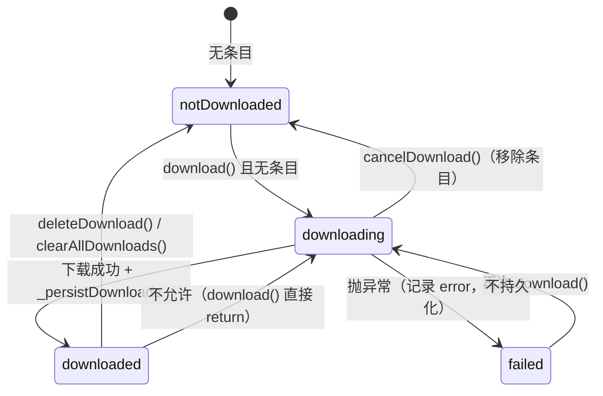

# 服务层 · 下载服务

> 文档编号：KA-03-04
> 级别：L2 📖
> 状态：现行
> 关联代码：lib/services/download_service.dart（393 行，主） + lib/controllers/download_controller.dart（552 行）、lib/config/app_config.dart、lib/controllers/player_controller.dart、lib/ui/pages/downloaded_songs_page.dart、lib/ui/pages/settings_page.dart
> 最近更新：2026-09-08
> 变更触发条件：改动并发上限/断点续传/目录名/索引键/播放缓存上限与 LRU 策略，或新增下载任务类型时

---

## 1. 一句话结论（TL;DR）

下载与播放缓存**共用一套队列、一个并发上限 3**：`DownloadService` 只管 IO（dio 下载、.part 断点续传、文件增删、LRU 删文件），`DownloadController` 只管状态与持久化（`DownloadEntry` / `PlayCacheEntry`、SharedPreferences 索引、播放缓存上限）。
用户下载落 `getApplicationDocumentsDirectory()/ka_music_downloads`（无上限、不参与 LRU），播放缓存落 `getTemporaryDirectory()/ka_music_play_cache`（默认 300MB，按 `cachedAt` 升序淘汰）。
下载**没有自动重试**；失败只写内存状态且不持久化，重启后丢失；断点续传仅靠 `.part` 文件长度 + `Range` 请求，服务端不支持 `Range` 时从头重下。

---

## 2. 现状

### 2.1 分工

| 层 | 类 | 行数 | 负责 | 不负责 |
|---|---|---|---|---|
| 服务层 | `DownloadService` | `lib/services/download_service.dart:36-393` | dio 下载、并发队列、`.part` 断点续传、取消、文件删除/大小统计、播放缓存 LRU 删文件 | 不持久化索引、不通知 UI、不调 API |
| 控制器层 | `DownloadController` | `lib/controllers/download_controller.dart:84-552` | 任务状态、进度聚合、索引读写、播放缓存上限、`notifyListeners`、调用 `MusicApi.songUrl` | 不直接做网络 IO |
| 装配点 | `main.dart` | `lib/main.dart:90-91`、`95` | `DownloadService` → `DownloadController` → 注入 `PlayerController.downloadController` | — |
| 启动加载 | `DownloadController.initialize()` | `lib/controllers/download_controller.dart:102-110` | 读设置 → 读两个索引 → 校验文件 → 启动 LRU 清理 | 不做目录全量扫描 |

### 2.2 任务模型

`enum DownloadTaskKind`（`lib/services/download_service.dart:11`）：

| 值 | 含义 | 目录 | 进度回调 | 队列优先级 |
|---|---|---|---|---|
| `download` | 用户主动下载 | `ka_music_downloads`（持久） | 有 | 高 |
| `playCache` | 播放缓存 | `ka_music_play_cache`（临时） | 无（静默） | 低 |

`class _PendingTask`（`download_service.dart:14-30`）：

| 字段 | 类型 | 说明 |
|---|---|---|
| `kind` | `DownloadTaskKind` | 任务类型 |
| `song` | `Song` | 曲目 |
| `quality` | `AudioQuality` | 音质，决定文件名与缓存键 |
| `url` | `String` | 已解析好的播放地址 |
| `completer` | `Completer<String>` | 完成时返回最终文件路径 |
| `onProgress` | `void Function(int received, int total)?` | 仅 `download` 传值 |

`enum DownloadStatus`（`lib/controllers/download_controller.dart:14`）：

| 值 | 含义 | 是否落盘 |
|---|---|---|
| `notDownloaded` | 无条目（**该枚举值不会被写入 `_downloads`**，删除条目即代表未下载） | — |
| `downloading` | 进行中 | 否 |
| `downloaded` | 完成 | 是 |
| `failed` | 失败 | 否 |

`class DownloadEntry`（`download_controller.dart:17-57`）：

| 字段 | 类型 | 默认 | 说明 |
|---|---|---|---|
| `song` | `Song` | 必填 | 曲目 |
| `quality` | `AudioQuality` | 必填 | 音质 |
| `status` | `DownloadStatus` | 必填 | 状态 |
| `progress` | `double` | 0 | 0~1 |
| `filePath` | `String?` | null | 最终文件路径 |
| `error` | `String?` | null | 失败信息（`copyWith` 会直接覆盖，不保留旧值，`51`） |
| `downloadedAt` | `DateTime?` | null | 完成时间 |
| `loudness` | `LoudnessData?` | null | 响度元数据（音量均衡用） |

`class PlayCacheEntry`（`download_controller.dart:60-78`）：

| 字段 | 类型 | 说明 |
|---|---|---|
| `cacheKey` | `String` | `{hash}_{quality.apiValue}` |
| `song` | `Song` | 曲目 |
| `quality` | `AudioQuality` | 音质 |
| `filePath` | `String` | 文件路径 |
| `size` | `int` | 写入时刻的文件字节数（**之后不再更新**） |
| `cachedAt` | `DateTime` | 写入时间，LRU 依据 |
| `loudness` | `LoudnessData?` | 响度元数据 |

### 2.3 目录、键与常量

| 项 | 值 | 锚点 |
|---|---|---|
| 下载目录名 | `ka_music_downloads` | `lib/config/app_config.dart:27` |
| 播放缓存目录名 | `ka_music_play_cache` | `lib/config/app_config.dart:28` |
| 下载根目录 | `getApplicationDocumentsDirectory()` | `download_service.dart:53` |
| 播放缓存根目录 | `getTemporaryDirectory()` | `download_service.dart:63` |
| 并发上限 | `AppConfig.maxConcurrentDownloads = 3` | `lib/config/app_config.dart:46`、`download_service.dart:47` |
| 播放缓存默认上限 | `300 * 1024 * 1024`（300MB） | `lib/config/app_config.dart:36` |
| 播放缓存下限 / 上限 | 100MB / 10GB | `lib/config/app_config.dart:37-38` |
| 播放缓存上限设置键 | `settings.play_cache_max_bytes`（`int`，字节） | `download_controller.dart:92` |
| 下载索引键 | `ka_music_downloads_index`（JSON 数组字符串） | `download_controller.dart:90` |
| 播放缓存索引键 | `ka_music_play_cache_index`（JSON 数组字符串） | `download_controller.dart:91` |
| 下载文件命名 | `{safeHash}_{quality.apiValue}.{ext}`，`ext` 为 `flac`（无损）或 `mp3` | `download_service.dart:72-76` |
| 缓存键 | `{safeHash}_{quality.apiValue}` | `download_service.dart:79-82` |
| hash 清洗 | 去掉所有非 `[a-zA-Z0-9_-]` 字符 | `download_service.dart:74`、`80` |
| dio 超时 | 连接 15s，接收 10 分钟 | `download_service.dart:41-42` |

---

## 3. 设计说明

### 3.1 队列与并发

| 行为 | 规则 | 锚点 |
|---|---|---|
| 入队 | `download()` / `cacheForPlayback()` 创建 `_PendingTask` 后调 `_enqueue` | `download_service.dart:87-122` |
| 优先级 | `download` 插到**第一个 `playCache` 之前**；若无 `playCache` 则追加到队尾 | `download_service.dart:124-138` |
| 并发 | `_running >= _maxConcurrent` 时不再启动新任务 | `download_service.dart:142-143` |
| 调度节奏 | 每次 `_processQueue` 只启动 1 个任务；任务结束后在 `finally` 再调一次 | `download_service.dart:146-157` |
| 完成/失败 | 成功 `completer.complete(path)`，失败 `completer.completeError(error)` | `download_service.dart:150-153` |
| 跨类型共享并发 | `download` 与 `playCache` 共用同一个 `_running` 计数 | `download_service.dart:47-48` |

> 注释与实现的偏差：`_enqueue` 注释写「插入队列头部之后（在其它下载任务之后、播放缓存之前）」，实际实现是「插到第一个 `playCache` 之前」（`download_service.dart:125-135`）——语义一致，措辞易误读。

### 3.2 断点续传实现

| 步骤 | 实现 | 锚点 |
|---|---|---|
| 临时文件 | 目标路径 + `.part` 后缀 | `download_service.dart:167-168` |
| 已有分片 | `startOffset = await partFile.length()` | `download_service.dart:175-178` |
| 请求头 | `startOffset > 0` 时加 `Range: bytes=<startOffset>-` | `download_service.dart:180-183` |
| 保留分片 | `deleteOnError: false`（失败不删 `.part`，供下次续传） | `download_service.dart:195`、`209` |
| 服务端忽略 Range | 响应码 ≠ 206 → 删 `.part`、`startOffset = 0`、重下一次 | `download_service.dart:199-211` |
| 范围校验 | `statusCode == 206` 且 `Content-Range` 的起始值必须等于 `startOffset`，否则抛 `StateError('服务器返回了不匹配的断点范围')` | `download_service.dart:213-226` |
| 空结果校验 | 文件不存在或长度为 0 → 抛 `StateError('下载结果为空')` | `download_service.dart:227-229` |
| 完成 | `.part` 重命名为最终文件名 | `download_service.dart:232-234` |
| 无分段元数据 | 只有 `.part` 长度，无「总大小/已校验分段」记录 | 全实现 |

### 3.3 进度回调

| 项 | 实现 | 锚点 |
|---|---|---|
| 回调签名 | `void Function(int received, int total)` | `download_service.dart:29`、`91` |
| 续传时的数值 | `actualTotal = startOffset + total`、`actualReceived = startOffset + received` | `download_service.dart:188-192` |
| 忽略 Range 重下时 | 直接回调 `(received, total)`，不加偏移 | `download_service.dart:205-207` |
| 进度计算 | 控制器内 `total > 0 ? received / total : 0.0` | `download_controller.dart:342-349` |
| 服务端不给 `Content-Length` | `total` 为负数 → 进度恒为 0 | 同上 |
| 播放缓存 | 不传 `onProgress`，无进度上报 | `download_service.dart:107-122` |
| 通知频率 | 每次 dio 回调都 `notifyListeners()`，无节流 | `download_controller.dart:347` |

### 3.4 失败与重试

| 情形 | 行为 | 锚点 |
|---|---|---|
| dio 异常 | 原样 `rethrow`；播放缓存被取消时删除 `.part` | `download_service.dart:237-242` |
| 控制器捕获 | 写 `DownloadStatus.failed` + `error`，`notifyListeners()` | `download_controller.dart:362-370` |
| 自动重试 | **无**（无重试次数、无退避） | 全实现 |
| 手动重试 | 再次调用 `download()`：仅 `downloading` / `downloaded` 会被跳过，`failed` 可重下 | `download_controller.dart:321-323` |
| 失败条目持久化 | **不持久化**（`_persistDownloads` 只写 `downloaded`） | `download_controller.dart:199-210` |
| 播放缓存失败 | 静默忽略（`catch (_) {}`） | `download_controller.dart:457-459` |

### 3.5 取消

| 方法 | 作用范围 | 排队任务处理 | 运行中任务处理 | 锚点 |
|---|---|---|---|---|
| `DownloadService.cancel(cacheKey)` | **不限类型**，匹配同一 `cacheKey` 的所有排队任务 | 移出队列并 `completeError(StateError('download cancelled'))` | 触发 `CancelToken.cancel()` | `download_service.dart:250-266` |
| `DownloadService.cancelPlayCache(cacheKey)` | 仅 `playCache` 任务 | 移出队列并报错，同时删除 `.part` | 仅当运行中任务也是 `playCache` 才取消 | `download_service.dart:268-295` |
| `DownloadController.cancelDownload(song)` | 用户下载 | 调 `cancel` 后**直接移除条目** | 同左 | `download_controller.dart:374-382` |
| `DownloadController.cancelPlaybackCache(song, quality)` | 播放缓存 | 调 `cancelPlayCache`（不删索引条目） | 同左 | `download_controller.dart:493-496` |

### 3.6 索引持久化

下载索引（`ka_music_downloads_index`，`download_controller.dart:197-212`）：

| 字段 | 类型 | 说明 |
|---|---|---|
| `song` | `Map` | `Song.toCache()` 序列化结果 |
| `quality` | `String` | `AudioQuality.apiValue`（`128` / `320` / `flac`） |
| `filePath` | `String?` | 文件路径 |
| `downloadedAt` | `String?` | ISO8601 |
| `loudness` | `Map?` | 仅非空时写入 |

播放缓存索引（`ka_music_play_cache_index`，`download_controller.dart:214-230`）：

| 字段 | 类型 | 说明 |
|---|---|---|
| `cacheKey` | `String` | `{hash}_{quality}` |
| `song` | `Map` | `Song.toCache()` |
| `quality` | `String` | `apiValue` |
| `filePath` | `String` | 路径 |
| `size` | `int` | 写入时字节数 |
| `cachedAt` | `String` | ISO8601 |
| `loudness` | `Map?` | 仅非空时写入 |

| 行为 | 规则 | 锚点 |
|---|---|---|
| 加载校验 | 逐条检查文件存在且大小 > 0，否则丢弃该条 | `download_controller.dart:139-141`、`171-173` |
| 下载索引写入时机 | 下载成功、删除单曲、清空全部 | `361`、`393`、`405` |
| 播放缓存写入时机 | 5 秒防抖定时器触发 `flush()`；`dispose()` 时强制 flush | `download_controller.dart:232-238`、`547-551` |
| 并发写入保护 | `_playCachePersistFuture` 复用同一 Future，避免重复写 | `download_controller.dart:240-254` |
| 损坏数据 | `catch (_) {}` 静默跳过整份索引 | `157`、`194` |

### 3.7 播放缓存与用户下载的区别

| 维度 | 用户下载（`download`） | 播放缓存（`playCache`） |
|---|---|---|
| 触发者 | 用户点击下载 | `PlayerController` 稳定播放 30 秒后自动 |
| 目录 | `getApplicationDocumentsDirectory()/ka_music_downloads` | `getTemporaryDirectory()/ka_music_play_cache` |
| 系统清理风险 | 低（Documents 目录） | 高（临时目录可能被系统回收） |
| 上限 | 无 | 默认 300MB，可调 100MB~10GB |
| 淘汰 | 无（用户手动删） | LRU，按 `cachedAt` 升序 |
| 进度上报 | 有 | 无 |
| 队列优先级 | 高（插到 playCache 之前） | 低 |
| 断点续传 | 有 | 有（同一实现） |
| 取消接口 | `cancel(cacheKey)` | `cancelPlayCache(cacheKey)` |
| 索引键 | `ka_music_downloads_index`，以 `hash` 为条目键 | `ka_music_play_cache_index`，以 `hash_quality` 为条目键 |
| 状态枚举 | `DownloadStatus` | 无（只有条目存在/不存在） |
| 失败处理 | 记录 `failed` + `error` | 静默忽略 |
| 响度元数据 | 写入 `DownloadEntry.loudness` | 写入 `PlayCacheEntry.loudness` |
| 离线播放 | 优先命中（同音质） | 次优先命中（同音质） |

### 3.8 LRU 清理

| 项 | 事实 | 锚点 |
|---|---|---|
| 触发点 1 | `initialize()` 启动时（`excludePaths = {}`） | `download_controller.dart:108-109` |
| 触发点 2 | `setPlayCacheMaxBytes()` 改上限后立即清理 | `download_controller.dart:305-314` |
| 触发点 3 | 每次播放缓存写入成功后 | `download_controller.dart:455-456` |
| 上限来源 | `playCacheMaxBytes` ← SharedPreferences `settings.play_cache_max_bytes` ← `AppConfig.defaultPlayCacheMaxBytes` | `download_controller.dart:99`、`112-117` |
| 上限钳制 | `clamp(minPlayCacheMaxBytes, maxPlayCacheMaxBytes)` = 100MB~10GB | `download_controller.dart:119-124` |
| 淘汰依据 | `cachedAt` 升序（**写入时间，不是最后访问时间**） | `download_service.dart:376-377` |
| 排除项 | `excludePaths`（正在播放的文件） | `download_service.dart:381` |
| 提前返回 | 总大小 ≤ 上限时不做任何删除 | `download_service.dart:373` |
| 返回值 | 被删除条目的 `cacheKey` 集合，控制器据此从内存索引移除 | `download_service.dart:384`、`download_controller.dart:538-544` |
| 下载目录 | **不参与 LRU**，永不自动清理 | `lib/config/app_config.dart:35` 注释 |

### 3.9 下载状态机

| 转换 | 触发 | 附带动作 | 锚点 |
|---|---|---|---|
| 无条目 → `downloading` | `download(song, quality)` | 写入 `progress: 0` 并通知 | `download_controller.dart:325-331` |
| `downloading` → `downloaded` | `DownloadService.download` 返回路径 | 写 `filePath` / `downloadedAt` / `loudness`，持久化 | `download_controller.dart:351-361` |
| `downloading` → `failed` | 任意异常（含 `songUrl` 无地址） | 写 `error`，不持久化 | `download_controller.dart:362-370` |
| `downloading` → 无条目 | `cancelDownload()` | 取消底层任务 | `download_controller.dart:374-382` |
| `downloaded` → 无条目 | `deleteDownload()` / `clearAllDownloads()` | 删文件 + 持久化 | `download_controller.dart:385-406` |
| `failed` → `downloading` | 用户再次点击下载 | 覆盖条目 | `download_controller.dart:321-331` |
| `downloaded` → `downloading` | 被 `321-323` 拦截 | 无 | `download_controller.dart:323` |

### 3.10 与 PlayerController 的交互

| 场景 | 行为 | 锚点 |
|---|---|---|
| 播放前解析音源 | 先查 `downloadController.localSourceFor(song, quality)`，命中即用本地文件，不发网络请求 | `player_controller.dart:612-617` |
| 本地文件加载失败 | 删除该播放缓存条目，回退网络解析（`SongSource.local` 除外，直接抛错） | `player_controller.dart:618-633` |
| 本地命中时的响度 | 从 `entry.loudness` 恢复，无需再请求 API | `player_controller.dart:615`、`2444-2448` |
| 旧索引补响度 | 播放时异步拉 `/song/url` 并 `updateLocalLoudness` 回写 | `player_controller.dart:796-809`、`download_controller.dart:463-491` |
| 网络播放成功 | 稳定播放 30 秒后调度 `cacheForPlayback`（定时器 `Duration(seconds: 30)`） | `player_controller.dart:667-675`、`1010-1038` |
| 暂停 | 取消定时器并 `cancelPlaybackCache`（中断在途缓存） | `player_controller.dart:157`、`1054-1062` |
| 恢复播放 | 若仍有待缓存曲目则重新调度 | `player_controller.dart:155`、`1064-1073` |
| 切歌 | `_cancelPendingPlaybackCache` 取消上一首的待缓存任务 | `player_controller.dart:586`、`1040-1052` |
| 无缝播放预解析 | 本地命中则**跳过**网络预解析（本地加载已接近无缝） | `player_controller.dart:1235-1243` |
| 重播 / 拖动后重载 | 同样本地优先 | `player_controller.dart:1853-1857` |
| 退出 | `DownloadController.dispose()` 触发 `flush()` 落盘 | `download_controller.dart:547-551` |

### 3.11 与 UI 的交互

用户下载的入口共 5 处，全部走歌曲操作菜单，且**都传入当前播放音质** `player.audioQuality`：

| 入口页面 | 调用 | 锚点 |
|---|---|---|
| 搜索结果 | `downloadController.download(song, player.audioQuality)` | `lib/ui/pages/search_page.dart:972-975` |
| 首页列表 | 同上 | `lib/ui/pages/home_page.dart:1037-1040` |
| 云盘页 | 同上 | `lib/ui/pages/cloud_drive_page.dart:575-578` |
| 歌单详情 | 同上 | `lib/ui/pages/playlist_detail_page.dart:1614-1617` |
| 播放历史 | 同上 | `lib/ui/pages/playback_history_page.dart:372-375` |

菜单项文案由 `isDownloaded(song)` 决定（「已下载」/「下载」），菜单本身不按状态禁用；重复点击由 `download()` 内部提前返回拦截（见 §3.9）。

| 界面 | 使用 | 锚点 |
|---|---|---|
| 已下载列表 | `downloads.downloadEntries` | `lib/ui/pages/downloaded_songs_page.dart:96` |
| 播放缓存列表 | `downloads.playCacheEntries` | `downloaded_songs_page.dart:317` |
| 删除单条播放缓存 | `deletePlayCache` | `downloaded_songs_page.dart:360` |
| 清空播放缓存 | `clearPlayCache` | `downloaded_songs_page.dart:383` |
| 资料库入口计数 | `downloads.downloadedSongs.length` | `lib/ui/pages/library_page.dart:354` |
| 设置页容量展示 | `getDownloadDirSize` / `getPlayCacheDirSize`（每次遍历目录统计） | `lib/ui/pages/settings_page.dart:871`、`874` |
| 设置页清空缓存 | `clearPlayCache` | `settings_page.dart:1008` |
| 设置页改上限 | `setPlayCacheMaxBytes` | `settings_page.dart:1034` |

---

## 4. 约束与坑

| 编号 | 问题 | 锚点 | 影响 |
|---|---|---|---|
| DL-01 | `_cancelTokens` / `_runningTasks` 以 `cacheKey` 为键，同曲同音质的 `download` 与 `playCache` 并发时会互相覆盖条目，`finally` 里的 `remove` 会误删另一任务的记录 | `download_service.dart:161-171`、`244-246` | 取消可能失效或误取消 |
| DL-02 | 下载索引以 `song.hash` 为键 → **同曲只能保留一个音质**；换音质重下会覆盖条目，旧文件成为孤儿 | `download_controller.dart:94`、`144`、`351-359` | 磁盘泄漏，且 `deleteDownload` 只删最新路径 |
| DL-03 | 失败条目（`failed`）不持久化，重启后状态丢失（文件可能仍是半截 `.part`） | `download_controller.dart:199-210` | 用户看不到失败记录 |
| DL-04 | `deleteDownload` / `clearAllDownloads` 只删最终文件，不删同名 `.part` | `download_service.dart:298-303`、`download_controller.dart:385-406` | 残留分片占空间 |
| DL-05 | 播放缓存 LRU 依据 `cachedAt`（写入时间），与术语表中「LRU 按最后访问时间」的定义不一致；`cacheForPlayback` 命中已存在条目时也不刷新 `cachedAt` | `download_service.dart:376-377`、`download_controller.dart:419-434` | 常播歌曲仍可能被淘汰 |
| DL-06 | `prunePlayCache` 只按内存索引删文件，**不扫描目录**；索引与实际文件不一致时孤儿文件永不清理（只能 `clearPlayCacheDir` 全清） | `download_service.dart:364-387` | 缓存目录实际占用可能超过上限 |
| DL-07 | `PlayCacheEntry.size` 是写入时快照，之后不再更新 | `download_controller.dart:443-452` | 上限统计与真实占用可能偏差 |
| DL-08 | 下载无自动重试、无断网恢复、无后台重试队列 | 全实现 | 弱网/切后台需用户手动重试 |
| DL-09 | `clearPlayCacheDir` 只删文件、不删子目录（若有嵌套目录则残留） | `download_service.dart:349-358` | 目录残留 |
| DL-11 | 下载无上限、无配额提示，设置页也不展示下载目录清理入口（只有播放缓存） | `lib/config/app_config.dart:35`、`settings_page.dart:1008` | 用户可能不知不觉占用大量磁盘 |
| DL-12 | `_processQueue` 递归调用自身（`finally` 中），队列很长时形成异步递归链 | `download_service.dart:154-157` | 逻辑上安全，但异常排查时栈不直观 |
| DL-13 | 队列与运行中任务全在内存，进程被杀后 `.part` 残留且索引无记录 | `download_service.dart:45-49` | 重启后无法续传（只能重新下载） |
| DL-14 | `.part` 重命名为已存在的目标文件时依赖平台 `rename` 覆盖语义 | `download_service.dart:232-234` | Windows 下行为**待核实** |

---

## 5. 待办与关联

| 关联文档 | 关系 |
|---|---|
| `../03-模块详解/服务层-缓存体系.md` | 四套本地存储总览（含播放缓存/下载的定位） |
| `../03-模块详解/服务层-MusicApi.md` | `songUrl` 提供下载地址与响度 |
| `../03-模块详解/控制器层-PlayerController.md` | 预缓存、离线播放、音量均衡交互 |
| `../03-模块详解/控制器层-DownloadController.md` | 控制器层详细状态与 UI 绑定 |
| `../04-数据与接口/本地存储与配置项清单.md` | `settings.play_cache_max_bytes`、两个索引键 |
| `../06-质量保障/已知问题与技术债台账.md` | DL-01~DL-14 应登记 |

待办（候选）：

| 编号 | 事项 | 依据 |
|---|---|---|
| T-DL-1 | 取消令牌与运行中任务改用「任务 ID」为键，避免同曲同音质冲突 | DL-01 |
| T-DL-2 | 下载索引改为 `hash + quality` 复合键，并在删除时清理旧音质文件与 `.part` | DL-02、DL-04 |
| T-DL-3 | 持久化 `failed` 状态与错误原因，重启后可见可重试 | DL-03 |
| T-DL-4 | 播放缓存改为记录 `lastAccessedAt` 并以其作为 LRU 依据 | DL-05 |
| T-DL-5 | `prunePlayCache` 增加目录扫描，清理孤儿文件 | DL-06 |
| T-DL-6 | 为下载补 `test/` 单测（当前无覆盖） | `test/` 目录 |
