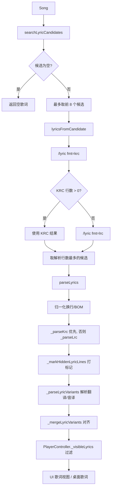

> 文档编号：KA-03-06
> 级别：L2 📖
> 状态：现行
> 关联代码：lib/services/music_api.dart（parseLyrics 与候选检索）、lib/models/music_models.dart（LyricLine / LyricWord / LyricCandidate）、lib/controllers/player_controller.dart（歌词编排）、lib/services/desktop_lyrics_service.dart、lib/ui/pages/player_page.dart、android/app/src/main/kotlin/com/hoilai/mm/music/LyricsOverlayService.kt、KaraokeTextView.kt、MainActivity.kt
> 最近更新：2026-09-08
> 变更触发条件：歌词解析规则（LRC/KRC/元数据识别/对齐）变化、LyricLine / LyricWord 字段变化、候选切换持久化键变化、桌面歌词 MethodChannel 方法或 Android 侧 Action/Extra 变化、`settings.lyric_scale` 或 `settings.lyric_display_mode` 取值变化

# 服务层-歌词与桌面歌词

## 1. 一句话结论（TL;DR）

歌词链路是「`/search/lyric` 取候选 → `/lyric` 逐候选取 KRC/LRC → `parseLyrics` 归一化 → 打 `hidden`/`titleCard` 标记保留行号 → 按时间或行号对齐翻译/音译」；**非歌词行一律不删，只打标记**，因为删除会使主歌词与翻译轨错开（lib/services/music_api.dart:894-896）。

桌面歌词是 Android 专属能力：Flutter 侧 `DesktopLyricsService`（通道 `kgka_music_hl/desktop_lyrics`）只负责下发状态，真正的悬浮窗由 `LyricsOverlayService` 前台服务（`specialUse`）持有，逐字高亮由 `KaraokeTextView` 用 `Choreographer` 帧回调驱动。

---

## 2. 现状

### 2.1 歌词接口差异

| 项 | `/search/lyric` | `/lyric` |
|---|---|---|
| 用途 | 搜索歌词候选列表 | 按候选取歌词正文 |
| 关键入参 | `hash`、`album_audio_id`、`keywords`、`keyword`、`duration`、`man=yes` | `id`、`accesskey`、`fmt`、`decode=true` |
| 返回 | 候选列表（id + accesskey） | `rawContent` / `decodedContent` / `decodedTranslation` / `rawJson` |
| 代码锚点 | lib/services/music_api.dart:752-795 | lib/services/music_api.dart:803-866 |
| OpenAPI 锚点 | api.json:2177-2222 | api.json:2223-2290、schema api.json:8315-8346 |
| 调用顺序 | 先调，最多取 8 个候选 | 每个候选先 `fmt=krc`，为空再 `fmt=lrc` |

候选字段映射（lib/models/music_models.dart:1298-1325）：

| 字段 | 取值来源（按优先级） |
|---|---|
| `id` | `id` → `lyrics_id` → `lyric_id` → `lyricid` |
| `accessKey` | `accesskey` → `access_key` → `accessKey` |
| `title` | `song` → `songname` → `song_name` → `title` → `name` |
| `artist` | `singer` → `singername` → `artist` → `author_name` |
| `album` | `album_name` → `album` |
| `score` | `score` → `similarity` |

候选去重键为 `${id}:${accessKey}`（lib/services/music_api.dart:790-794）；候选收集从根节点递归，避免只拿到摘要/片段（:773-789）。

### 2.2 解析流程

### 2.3 LRC 与 KRC 解析规则

| 格式 | 行时间戳正则 | 词时间戳正则 | 其他 | 锚点 |
|---|---|---|---|---|
| KRC | `^\[\s*(-?\d+)\s*,\s*(-?\d+)\s*\](.*)$`（起始 ms, 时长 ms） | `<\s*(-?\d+)\s*,\s*(-?\d+)\s*,\s*(-?\d+)\s*>`（起始偏移, 时长, 保留位） | 行时间 = `start + offset`；词时间 = `start + wordStart + offset` | music_api.dart:932-1001 |
| LRC | `\[(\d{1,2}):(\d{1,2})(?:[.:](\d{1,3}))?\]` | 无 | 一行多个时间戳会展开成多行；毫秒不足 3 位右补零 | music_api.dart:1036-1077 |
| 公共 | `^\[offset:([+-]?\d+)\]` | — | 偏移量单位 ms，解析失败按 0 | music_api.dart:1079-1085 |
| KRC 语言轨 | `^\[language:([A-Za-z0-9+/=]+)\]` | — | Base64 → UTF-8 → JSON | music_api.dart:1134-1178 |

内容归一化（lib/services/music_api.dart:883-888）：去掉首个 BOM、`\r\n`、`\r`、字面量 `\\r\\n`、`\\n` 全部转 `\n`。

候选内容评分（`_lyricContentScore`，lib/services/music_api.dart:1087-1108）：含 `[数字,数字]` + `<` 加 100 分；含 `[数字,数字]` 加 60 分；含 `[分:秒` 加 40 分；含 `[language:` 加 10 分；同分时取更长的内容（:838-841）。

### 2.4 模型字段

`LyricLine`（lib/models/music_models.dart:1187）：

| 字段 | 类型 | 默认值 | 说明 | 缓存键 |
|---|---|---|---|---|
| `time` | Duration | 必填 | 行起始时间 | `timeMs` |
| `text` | String | 必填 | 行文本 | `text` |
| `duration` | Duration? | null | 行时长（仅 KRC 提供） | `durationMs` |
| `translation` | String? | null | 翻译 | `translation` |
| `romanization` | String? | null | 罗马音/音译 | `romanization` |
| `words` | List<LyricWord> | `const []` | 词级时间戳 | `words` |
| `hidden` | bool | `false` | 署名/水印等非歌词行，UI 隐藏但保留行位 | 仅 true 时写 `hidden` |
| `titleCard` | bool | `false` | 歌名/歌手标题卡，保留展示 | 仅 true 时写 `titleCard` |

`LyricWord`（lib/models/music_models.dart:1342）：`time`（Duration）、`duration`（Duration）、`text`（String），缓存键 `timeMs` / `durationMs` / `text`。

`LyricLine.copyWith` 只允许改 `translation` / `romanization` / `hidden` / `titleCard`（:1213-1229）；`activeWordIndex(Duration)` 返回最后一个 `time <= position` 的词下标，无词返回 −1（:1231-1245）。

---

## 3. 设计说明与细节

### 3.1 翻译与音译对齐

| 来源 | 优先顺序 | 锚点 |
|---|---|---|
| 翻译 | `/lyric` 的 `decodedTranslation`（时间轨） > KRC `[language:]` 轨 | music_api.dart:1110-1122 |
| 罗马音 | 仅 KRC `[language:]` 轨（`type == 0`） | music_api.dart:1231-1234 |

对齐策略（`_mergeLyricVariants`，music_api.dart:1287-1332），逐行按以下顺序取值：

| 顺序 | 规则 | 说明 |
|---|---|---|
| 1 | `hidden == true` → 直接跳过，不挂翻译/音译 | 隐藏行与首句时间相近，避免错误挂上首句翻译（:1306-1311） |
| 2 | 时间精确匹配 `byTime[line.time.inMilliseconds]` | — |
| 3 | 时间就近匹配 `_nearestLyricVariant` | — |
| 4 | 行号对齐 `indexedTranslations[index]` | 由 `_indexedLyricVariants` 生成 |

行号对齐规则（`_indexedLyricVariants`，music_api.dart:1334-1364）：

| 情况 | 处理 |
|---|---|
| 语言轨行是 LLM 水印（`_isLyricAttributionText`）且当前主歌词行**不是** hidden | 丢弃该行（不占用行位） |
| 语言轨行是空串 | 占用行位但不赋值 |
| 语言轨行与主歌词文本「压缩后」相同 | 不赋值（`_sameLyricText` 忽略标点与大小写） |
| 其他非空行 | 赋给当前主歌词行 |

### 3.2 元数据行识别规则

`_isLyricMetadataText`（lib/services/music_api.dart:1472-1633）按以下顺序判定：

| 步骤 | 规则 | 锚点 |
|---|---|---|
| 1 | 命中 `_lyricAttributionPattern`（LLM 翻译水印） | :1474、:907-913 |
| 2 | 无冒号（`:` 或 `：`）→ 非元数据 | :1477-1481 |
| 3 | 冒号位置 > 40 → 非元数据（40 覆盖最长英文复合署名前缀） | :1479 |
| 4 | 前缀小写、空白归一、繁体/日文汉字转简体（19 字映射表） | :1483-1491、:1438-1457 |
| 5 | 前缀整体命中署名词表 → 元数据 | :1493-1592 |
| 6 | 前缀按 `[\s/&+]` 分段，全部命中词表 → 元数据 | :1598-1604 |
| 7 | 压缩前缀（去空白与 `&+/_-`）包含任一 `productionRoleTokens` → 元数据 | :1609-1632 |

署名词表（`prefixes`，lib/services/music_api.dart:1493-1591）按类别归纳：

| 类别 | 词条 |
|---|---|
| 中文创作 | 词、曲、作词、填词、作曲、词曲、编曲、演唱、歌手、艺人、原唱、翻唱 |
| 翻译类 | 翻译、译文、音译、罗马音、罗马字、拼音 |
| 制作类 | 制作、制作人、出品、发行、企划、监制、统筹、版权 |
| 录音/混音/母带 | 录音、录音师、录音室、混音、混音师、混音室、母带、母带师、母带室、录制 |
| 人声/器乐 | 和声、和声编写、和声编配、配唱、人声、吉他、贝斯、鼓、键盘、弦乐、乐器独奏、演奏、助理 |
| 英文 | vocal、vocals、translation、translated by、lyric、lyrics、lyricist、composer、arranger、producer、produced by、mix、mixing、mixed、master、mastering、mastered、recording、guitar、bass、drums、piano、strings、keyboard、keyboards、percussion、synth、synthesizer、orchestra、chorus、programming、engineer、engineers、recording engineer(s)、mixing engineer(s)、recording & mixing engineer(s)、recording and mixing engineer(s)、publisher、copyright |
| 编号类 | op、sp、cp、isrc、upc |

`productionRoleTokens`（:1610-1631）：recording、mixing、mastering、engineer、engineers、producer、produced、arranger、arrangement、instrument、supervisor、assistant、recorded、translated、editing、written、director、executive、coordinator、planning。

标题卡识别（`_looksLikeLeadingTitleCredit`，music_api.dart:1366-1383）：

| 条件 | 阈值 |
|---|---|
| 只在前 3 行内判定 | `index > 2` 直接返回 false |
| 文本符合标题卡（`_isTitleCardText`）且时序符合（`_hasTitleCardTiming`） | 见下表 |
| 或文本含「空格+连字符+空格」或含 `/`，且后续 6 行内出现元数据行 | :1374-1382 |

`_isTitleCardText`（music_api.dart:1394-1414）：非空、长度 ≤ 60、不以句末标点结尾、恰好一个「空格+连字符+空格」且两侧非空；无空格连字符仅在两侧脚本不同时成立（如 `Ending Note-門谷純`）。

`_hasTitleCardTiming`（music_api.dart:1419-1434）：起始 ≤ 10 s，且自身时长 ≥ 8 s 或与下一行间隔 ≥ 8 s。

### 3.3 测试用例逐条说明

`test/lyric_metadata_test.dart`（16 个用例）：

| # | 用例名 | 断言要点 | 锚点 |
|---|---|---|---|
| 1 | credit lines never carry a translation | 署名行保留原文，`translation` 为 null | test/lyric_metadata_test.dart:21-39 |
| 2 | real lyric lines keep their translations aligned | 正文行翻译按时间对齐 | :41-48 |
| 3 | bilingual credit prefix is detected as metadata | `作词 Lyricist：` / `作曲 Composer：` 判定为元数据 | :50-69 |
| 4 | long compound credit prefix is detected as metadata | `Recording and Mixing Engineers：` 判定为元数据 | :71-86 |
| 5 | traditional/Japanese credit prefixes never carry the first-line translation | `作詞：` / `編曲：` 判定为元数据 | :88-109 |
| 6 | slash-combined credit prefixes are detected as metadata | `作詞/作曲：` 判定为元数据 | :111-126 |
| 7 | bilingual compound credits never carry the first-line translation | 5 个复合署名（Voicing Arrangement / Instrument Solo / Music Supervisor / Assistant / Produced by）均判定为元数据 | :128-163 |
| 8 | LLM attribution watermark in KRC translation list does not shift alignments | 翻译轨首行水印被丢弃，后续行仍 1:1 对齐 | :165-190 |
| 9 | watermark line in main lyrics is kept but hidden | 主歌词水印保留但 `hidden=true`，行数仍为 3 | :192-205 |
| 10 | leading title card never consumes the first indexed translation | 标题卡 `hidden=true` + `titleCard=true`，`translation=null` | :207-236 |
| 11 | empty translation rows occupy title/credit line slots | 空串占位行保持对齐 | :238-268 |
| 12 | AKINO 海色 production credits preserve KRC translation slots | 前 10 行标题/署名全部 hidden，翻译仍对齐 | :270-313 |
| 13 | watermark row pairs with hidden main line instead of shifting | 主歌词与翻译轨都带水印时互相配对 | :315-343 |
| 14 | short hyphenated first lyric line still consumes its translation | `Wow - oh` 不误判为标题卡（无时序证据） | :345-369 |
| 15 | colon-form attribution prefixes are detected as metadata | `翻译：文曲大模型` 判定为元数据 | :371-386 |
| 16 | hidden flag survives cache round-trip | `hidden` 经 `toCache`/`fromCache` 保持 | :388-399 |

### 3.4 候选版本切换

| 项 | 值 | 锚点 |
|---|---|---|
| 持久化键 | `settings.manual_lyric_candidates` | player_controller.dart:73-74 |
| 存储格式 | JSON 对象：`{songHash: LyricCandidate.toJson()}` | player_controller.dart:397-403 |
| 读取时机 | `_restoreSettings` | :2523-2538 |
| 选择入口 | `selectLyricCandidate(song, candidate, {preview})` | :382-411 |
| 恢复自动 | `restoreAutomaticLyrics(song)` | :413-426 |
| 候选搜索 | `searchLyricCandidates(song)` 转发 `MusicApi` | :376-377 |
| 候选预览 | `previewLyricCandidate(candidate)` | :379-380 |
| 手动优先 | 手动候选写入后立即让在途自动请求失效（`_lyricsLoadGeneration`） | :387-393 |
| 歌词缓存键 | `cache_lyric_v9_` + URL 编码的 `_lyricKey`（含候选 JSON） | :1602 |

`_lyricKey` = `${song.source.name}:${hash 或 id}:${候选 JSON}`（player_controller.dart:1560-1561），因此换候选会自动换缓存键。

### 3.5 显示与缩放

| 设置 | 键 | 取值 | 默认 | 锚点 |
|---|---|---|---|---|
| 歌词显示模式 | `settings.lyric_display_mode` | 枚举名（`lyricsWithTranslation` / `lyricsOnly` / `lyricsWithRomanization`） | `lyricsWithTranslation` | player_controller.dart:321、:428-433、:2518-2522 |
| 歌词字号缩放 | `settings.lyric_scale` | 0.7 ~ 1.6，步进 0.1 | 1.0 | player_page.dart:1853-1875、:1968-1974 |

可选模式由内容决定（player_page.dart:629-650）：有翻译才有「歌词+翻译」，有音译才有「歌词+音译」，`lyricsOnly` 恒可用；不可用模式会自动回退（:1894-1905）。

### 3.6 逐字高亮

| 端 | 实现 | 关键点 | 锚点 |
|---|---|---|---|
| Flutter | `_KaraokeLinePainter` | 用 `TextPainter.getBoxesForSelection` 取每词矩形，按 `progress` 裁剪后重绘高亮色 | player_page.dart:3164-3210 |
| Flutter 词进度 | `_wordProgress(word)` | 未到 `word.time` 返回 0；`duration <= 0` 返回 1；否则 `elapsed / duration` 夹到 0~1 | player_page.dart:3178-3189 |
| Android | `KaraokeTextView` | 双 `Paint`：先画暗色底字，再按 `progress` 裁剪画亮色字 | KaraokeTextView.kt:117-142 |
| Android 帧驱动 | `LyricsOverlayService.startKaraokeTicker` | `Choreographer` 帧回调，按锚点时间外推进度 | LyricsOverlayService.kt:316-347 |

### 3.7 桌面歌词

Flutter 侧 `DesktopLyricsService`（lib/services/desktop_lyrics_service.dart:63）：

| 方法 | 参数 | 返回 | 锚点 |
|---|---|---|---|
| `checkPermission()` | — | `Future<bool>`（非 Android 返回 false） | :98 |
| `requestPermission()` | — | `Future<void>` | :108 |
| `show({title, artist})` | 歌名、歌手 | `Future<bool>` | :117 |
| `hide()` | — | `Future<void>` | :132 |
| `updateLyrics({current, next})` | 当前行、下一行 | `Future<void>` | :141 |
| `updatePlayState({isPlaying})` | 播放状态 | `Future<void>` | :156 |
| `updateKaraokeProgress({progress, lineDuration, isPlaying})` | 0~1、行时长（null 传 0 ms） | `Future<void>` | :167 |
| `updateSettings(DesktopLyricsSettings)` | 见下表 | `Future<void>` | :184 |
| `setAppForeground({isForeground})` | 前后台 | `Future<void>` | :193 |
| `isVisible()` | — | `Future<bool>` | :204 |
| `setVisibilityChangedHandler(handler)` | 回调 | — | :76 |

`DesktopLyricsSettings` 字段（lib/services/desktop_lyrics_service.dart:7-61）：

| 字段 | 类型 | 默认值 | 取值/单位 | 持久化键 |
|---|---|---|---|---|
| `opacity` | double | 0.8 | 0.0 ~ 1.0 | `settings.desktop_lyrics_settings`（JSON） |
| `locked` | bool | false | — | 同上 |
| `passthrough` | bool | false | 锁定时强制 true | 同上 |
| `textColor` | int | `0xFFFFFFFF` | ARGB | 同上 |
| `backgroundColor` | int | `0xFF1A1A2E` | ARGB | 同上 |
| `fontSize` | double | 16.0 | 12 ~ 24（sp） | 同上 |

Android 侧 Action 与 Extra（LyricsOverlayService.kt:31-54）：

| Action | 常量值 | Extra |
|---|---|---|
| `ACTION_UPDATE_LYRICS` | `com.hoilai.mm.music.UPDATE_LYRICS` | `current_lyric`、`next_lyric`、`title`、`artist` |
| `ACTION_UPDATE_PLAY_STATE` | `com.hoilai.mm.music.UPDATE_PLAY_STATE` | `is_playing` |
| `ACTION_HIDE` | `com.hoilai.mm.music.HIDE_LYRICS` | — |
| `ACTION_UPDATE_KARAOKE` | `com.hoilai.mm.music.UPDATE_KARAOKE` | `progress`、`line_duration_ms`、`is_playing` |
| `ACTION_UPDATE_SETTINGS` | `com.hoilai.mm.music.UPDATE_SETTINGS` | `opacity`、`locked`、`passthrough`、`text_color`、`background_color`、`font_size` |
| `ACTION_SET_APP_FOREGROUND` | `com.hoilai.mm.music.SET_APP_FOREGROUND` | `is_foreground` |
| `ACTION_VISIBILITY_CHANGED` | `com.hoilai.mm.music.LYRICS_VISIBILITY_CHANGED` | `visible`、`user_closed` |

原生侧关键常量与行为：

| 项 | 值 | 锚点 |
|---|---|---|
| 通知渠道 ID | `kgka_music_hl.lyrics_overlay` | LyricsOverlayService.kt:28 |
| 通知 ID | 9001 | :29 |
| 原生偏好文件名 | `lyrics_overlay_prefs` | :56 |
| 位置默认值 | x=50, y=100 | :204-205 |
| 窗口类型 | `TYPE_APPLICATION_OVERLAY`（API ≥ 26）否则 `TYPE_PHONE` | :194-198 |
| 窗口标志 | `FLAG_NOT_FOCUSABLE` + `FLAG_NOT_TOUCH_MODAL`，穿透时加 `FLAG_NOT_TOUCHABLE` | :219-226 |
| 拖动阈值 | 10 px | :250 |
| 锁定后 | 触摸回调直接返回 false，不拖动 | :236、:247 |
| 返回码 | `START_STICKY` | :158 |
| 前台服务类型 | `specialUse` | android/app/src/main/AndroidManifest.xml:56-63 |
| 权限 | `SYSTEM_ALERT_WINDOW` | AndroidManifest.xml:9 |
| 是否在运行 | 遍历 `ActivityManager.getRunningServices` | LyricsOverlayService.kt:66-75 |

显示条件（lib/controllers/player_controller.dart:2102-2106）：`desktopLyricsEnabled && currentSong != null && (!_isAppForeground || _desktopLyricsPreviewVisible)`——即**仅当应用不在前台（或处于设置页预览）时显示**。

### 3.8 平台支持矩阵

| 能力 | Android | iOS | Windows | macOS | Linux | Web |
|---|---|---|---|---|---|---|
| 歌词获取/解析 | 支持 | 支持 | 支持 | 支持 | 支持 | 支持 |
| 逐字高亮（Flutter 侧） | 支持 | 支持 | 支持 | 支持 | 支持 | 支持 |
| 桌面歌词悬浮窗 | 支持 | 不支持 | 不支持 | 不支持 | 不支持 | 不支持 |
| 悬浮窗权限申请 | `SYSTEM_ALERT_WINDOW` | — | — | — | — | — |
| 本地 `.lrc` 文件歌词 | 支持 | 支持 | 支持 | 支持 | 支持 | 不支持 |

`DesktopLyricsService.isSupportedPlatform` 只认 Android（desktop_lyrics_service.dart:72-74）；本地歌词读取见 player_controller.dart:1592-1599（与音频同名的 `.lrc` 文件）。

---

## 4. 约束与坑

1. **隐藏行绝不删除**。`_markHiddenLyricLines` 只打标记（music_api.dart:920-930），`PlayerController._visibleLyrics` 过滤时保留 `titleCard`（player_controller.dart:370-372）。任何「顺手删掉署名行」的改动都会破坏翻译对齐。
2. **空串占位行必须保留**。行号轨不过滤空行（music_api.dart:1241-1245）；时间轨则跳过空行，避免遮蔽同时间翻译（:1236-1240）。
3. **翻译轨顶部水印只在配到非隐藏行时丢弃**（music_api.dart:1351-1354）；配到隐藏行时照常占位（用例 13）。
4. **时间匹配可能误挂**：第 3.1 节顺序 2/3 依赖时间就近匹配，署名行与首句时间重叠时必须靠 `hidden` 提前拦截（:1306-1311）。
5. **候选只取前 8 个**，且以「解析行数最多」为胜出标准（music_api.dart:740、:860-862）——行数相同则保留先到者。
6. **KRC 失败才回退 LRC**（music_api.dart:797-801）；若 KRC 返回非空但内容残缺，不会自动改用 LRC。
7. **`_isLyricMetadataText` 的冒号位置上限是 40**（:1479），超过 40 字符的英文复合署名前缀会被漏判。
8. **繁简映射表只有 19 个字**（:1438-1457），未覆盖的异体字可能漏判。
9. **标题卡识别依赖时序阈值**（起点 ≤ 10 s、时长或间隔 ≥ 8 s），没有时序信息的 LRC 歌词无法识别标题卡。
10. **桌面歌词只在应用不在前台时显示**（player_controller.dart:2102-2105），前台想预览必须走设置页的 `setDesktopLyricsPreviewVisible`（:2256-2260）。
11. **锁定位置会强制开启触摸穿透**，且穿透时点击无法取消（desktop_lyrics_settings_page.dart:121-138、LyricsOverlayService.kt:141、:236）。
12. **原生设置与 Flutter 设置是两份**：`locked` 在悬浮窗上切换后只发广播 `com.hoilai.mm.music.LYRICS_SETTINGS_CHANGED`（LyricsOverlayService.kt:404-411），Flutter 侧未监听该广播——存在状态不同步风险。
13. **歌词缓存 TTL 为 null**（player_controller.dart:1611），意味着缓存不过期，仅靠内存窗口 `_retainedLyricKeys`（前/当前/后三首）约束内存副本。
14. **`isVisible()` 只判断服务是否在运行**（遍历 `ActivityManager.getRunningServices`，LyricsOverlayService.kt:66-75），不能反映悬浮窗是否真的被系统添加成功；代码未做 Android 版本分支处理。

---

## 5. 待办与关联

| 关联文档 | 关系 |
|---|---|
| ../03-模块详解/控制器层-PlayerController.md | 歌词编排、候选切换、桌面歌词同步的实现方 |
| ../03-模块详解/服务层-音频与后台播放.md | 前台服务与音频焦点上下文 |
| ../04-数据与接口/API-端点清单.md | `/lyric`、`/search/lyric` 契约 |
| ../04-数据与接口/数据模型参考.md | `LyricLine` / `LyricWord` / `LyricCandidate` 字段 |
| ../04-数据与接口/本地存储与配置项清单.md | 本页设置键与原生偏好键 |
| ../05-平台与原生/ | 悬浮窗权限、前台服务类型登记 |
| ../06-质量保障/已知问题与技术债台账.md | 上文第 12、14 项建议登记 |

待核实项：

| 编号 | 内容 | 说明 |
|---|---|---|
| L-01 | 广播 `LYRICS_SETTINGS_CHANGED` 是否有消费方 | 全局检索未发现 Flutter 侧监听，需确认是否为遗留 |
| L-02 | `TYPE_PHONE` 分支在 API < 26 的实机表现 | 代码保留兼容分支，未做真机验证 |

自检：头部元信息完整；TL;DR 3 行内；枚举内容全部表格化；关键结论均带 `文件:行` 锚点；默认值与取值范围齐全；「约束与坑」非空；无臆造内容。