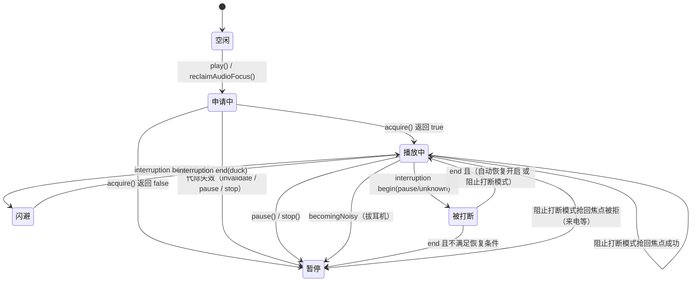

> 文档编号：KA-03-05
> 级别：L2 📖
> 状态：现行
> 关联代码：lib/services/music_audio_handler.dart（主）、lib/services/audio_focus_gate.dart、lib/services/audio_effects_service.dart、lib/controllers/player_controller.dart、lib/main.dart、android/app/src/main/kotlin/com/hoilai/mm/music/MainActivity.kt
> 最近更新：2026-09-08
> 变更触发条件：MusicAudioHandler 公开方法签名变化、audio_session 配置变化、AudioFocusGate 串行化语义变化、audio_effects 的通道名/方法名/参数变化、打断相关设置键的默认值或取值范围变化、Android 侧音频效果实现变化

# 服务层-音频与后台播放

## 1. 一句话结论（TL;DR）

音频与后台播放由三层组成：`audio_service` 的 `MusicAudioHandler`（通知栏/锁屏/媒体按键）承载传输控制，`just_audio` 的 `AudioPlayer` 承载解码播放，`audio_session` 承载系统音频焦点；三者之间的时序由 `AudioFocusGate` 串行化保证「过期请求永远不会拉起播放」（lib/services/audio_focus_gate.dart:1）。

打断策略不在 `just_audio` 内实现，而是由 `PlayerController` 在 `interruptionEventStream` 中统一实现，通过两个设置键切换：`settings.audio_interruption_enabled`（默认 true）与 `settings.auto_resume_after_interruption`（默认 false）。

音效（均衡器 / 低音增强 / LoudnessEnhancer）走自建 MethodChannel `kgka_music_hl/audio_effects`，仅 Android 支持（lib/services/audio_effects_service.dart:65）。

---

## 2. 现状

### 2.1 依赖与初始化

| 项 | 值 | 锚点 |
|---|---|---|
| audio_service | `^0.18.18` | pubspec.yaml:12 |
| audio_session | `^0.1.25` | pubspec.yaml:13 |
| just_audio | `^0.10.4` | pubspec.yaml:15 |
| 通知渠道 ID | `kgka_music_hl.playback` | lib/main.dart:35 |
| 通知渠道名 | `KA Music 播放控制` | lib/main.dart:36 |
| `androidStopForegroundOnPause` | `false`（暂停后仍保持前台服务） | lib/main.dart:37 |
| 装配点 | `AudioService.init(builder: MusicAudioHandler.new, ...)` | lib/main.dart:32-39 |

### 2.2 MusicAudioHandler 关键字段

| 字段/常量 | 类型 | 默认值 | 说明 | 锚点 |
|---|---|---|---|---|
| `_queueWindowRadius` | int | 25 | 通知栏队列窗口半径，窗口最大 51 条 | lib/services/music_audio_handler.dart:11 |
| `audioPlayer` | AudioPlayer | — | `handleInterruptions: false`、`handleAudioSessionActivation: false` | :23-26 |
| `_focus` | AudioFocusGate | — | Android 上 `resetBeforeAcquire: true` | :27-32 |
| `_transportGeneration` | int | 0 | 传输代际号，用于丢弃过期播放 | :33 |
| `onPlaybackIntent` | `void Function(bool)?` | null | 通知栏/锁屏发起播放意图时回调控制器 | :34 |
| `_onNext` / `_onPrevious` | `Future<void> Function()?` | null | 由控制器注入的切歌实现 | :41-51 |
| `_queueIndex` | int | 0 | 当前曲目在**窗口内**的下标 | :43 |

### 2.3 公开方法清单

| 方法签名 | 行为 | 锚点 |
|---|---|---|
| `invalidatePendingPlay()` | 代际号 +1 并 `_focus.invalidate()` | :36 |
| `attachTransportControls({onNext, onPrevious})` | 注入切歌回调 | :45 |
| `detachTransportControls()` | 清空切歌回调与 `onPlaybackIntent` | :53 |
| `loadSong({song, url, queueSongs, queueIndex})` | 先 `pauseForInterruption()`，再写队列窗口、`mediaItem`，最后 `setAudioSources` 单元素列表 | :66-86 |
| `appendPlaylistEntry(Song, String url)` | 无缝播放：追加预载子源 | :90 |
| `removePlaylistEntryAt(int index)` | 移除播放列表子源 | :95 |
| `setCurrentMediaItem(Song)` | 无缝切换后同步通知栏元数据 | :100 |
| `setSongQueue({queueSongs, queueIndex, currentSong})` | 仅刷新通知栏队列窗口 | :109 |
| `replaceSongQueue({...})` | 语义同 `setSongQueue`（当前实现完全一致） | :123-134 |
| `play()` | `_play(userIntent: true)` | :137 |
| `reclaimAudioFocus()` | `_play(userIntent: false)`，阻止打断模式抢回焦点 | :139 |
| `pause()` | 取消待播 + 暂停 + 释放焦点（代际未变时） | :161-167 |
| `pauseForInterruption()` | 取消待播 + 暂停，**不释放**焦点 | :170 |
| `seek(Duration)` | 转发 `audioPlayer.seek` | :184 |
| `skipToNext()` / `skipToPrevious()` | 转发注入的 `_onNext` / `_onPrevious` | :189-196 |
| `stop()` | 取消待播 + 停止 + 释放焦点 | :199-205 |
| `close()` | 释放播放器与焦点 | :207 |

### 2.4 播放队列映射

`_windowedQueue`（lib/services/music_audio_handler.dart:213）只把当前曲目前后各 25 首映射到通知栏，避免长队列全量构建：

| 步骤 | 公式 | 说明 |
|---|---|---|
| 当前下标 | `current = queueIndex.clamp(0, songs.length - 1)` | 越界保护 |
| 起点 | `start = (current - 25).clamp(0, songs.length)` | — |
| 终点 | `end = (current + 25 + 1).clamp(start, songs.length)` | 右开区间 |
| 窗口内下标 | `index = current - start` | 写入 `_queueIndex` |

`MediaItem` 字段映射（lib/services/music_audio_handler.dart:224）：

| MediaItem 字段 | 取值 |
|---|---|
| `id` | `song.hash`，为空时退化为 `song.id` |
| `album` | `song.albumName` |
| `title` | `song.title` |
| `artist` | `song.artist` |
| `duration` | `song.duration` |
| `artUri` | `Uri.tryParse(song.coverUrl)`，为空则 null |
| `extras` | `{'hash': song.hash, 'songId': song.id}` |

`PlaybackState` 映射（lib/services/music_audio_handler.dart:236）：

| 字段 | 取值 |
|---|---|
| `controls` | `[skipToPrevious, (playing ? pause : play), skipToNext]` |
| `systemActions` | `{seek, seekBackward, seekForward}` |
| `androidCompactActionIndices` | `[0, 1, 2]` |
| `processingState` | `idle/loading/buffering/ready/completed` 一一映射 |
| `playing` | `audioPlayer.playing` |
| `updatePosition` | `audioPlayer.position` |
| `bufferedPosition` | `audioPlayer.bufferedPosition` |
| `speed` | `audioPlayer.speed` |
| `queueIndex` | `_queueIndex`（窗口内下标） |

---

## 3. 设计说明与细节

### 3.1 AudioFocusGate 串行化机制

`AudioFocusGate`（lib/services/audio_focus_gate.dart:2）把原生 `AudioSession.setActive` 串行化到单条 Future 链上，并用代际号让「过期请求」在进入原生调用前后各判一次：

| 成员 | 作用 | 锚点 |
|---|---|---|
| `resetBeforeAcquire` | Android 为 true：每次申请焦点前先 `setActive(false)` 清掉 audio_session 的缓存请求 | :9、:27 |
| `_tail` | Future 链尾，保证原生调用不并发 | :12 |
| `_generation` | 代际号；`invalidate()` 递增 | :13-15 |
| `_enqueue` | 把操作串到 `_tail` 后，并把异常从链尾吞掉，避免「毒化」后续请求 | :17-21 |
| `acquire()` | 递增代际 → 入队 → 校验代际 → 可选复位 → 再次校验 → 申请 → 被拒时再复位一次 | :23-37 |
| `release()` | `invalidate()` 后入队 `setActive(false)` | :39-44 |

`acquire()` 的关键语义：**被拒 ≠ 可以播放**，且「被拒」也要复位缓存请求（lib/services/audio_focus_gate.dart:30-34）。

### 3.2 音频焦点状态机

各迁移的代码锚点：

| 迁移 | 实现 | 锚点 |
|---|---|---|
| 申请焦点 → 播放 | `_play` 中 `_focus.acquire()` 为真才 `audioPlayer.play()` | lib/services/music_audio_handler.dart:146-157 |
| 申请被拒 → 暂停 | `await audioPlayer.pause()` | :148-151 |
| 代际失效 → 放弃 | `if (generation != _transportGeneration) return;` | :147 |
| 闪避 | `_setDucked(event.begin)` → 音量 × 0.5 | lib/controllers/player_controller.dart:1930-1932、:240-241 |
| 被打断（暂停型） | `_audioHandler.pauseForInterruption()` | :1947-1951 |
| 阻止打断模式抢回 | `_reclaimAudioFocus()` → `_audioHandler.reclaimAudioFocus()` | :1990-1997 |
| 恢复播放 | `shouldResume = 打断前在播放 && (autoResume 或 !audioInterruptionEnabled)` | :1953-1962 |
| 拔耳机 | 固定 `_audioHandler.pause()`，不自动恢复 | :1965-1968 |

### 3.3 audio_session 配置

`_audioSessionConfiguration`（lib/controllers/player_controller.dart:2024）根据 `settings.audio_interruption_enabled` 返回两种配置：

| 配置项 | 允许打断（enabled=true，默认） | 阻止打断（enabled=false） |
|---|---|---|
| 整体 | `AudioSessionConfiguration.music()` | 自定义 `AudioSessionConfiguration` |
| `androidAudioAttributes.contentType` | 由 `music()` 提供 | `AndroidAudioContentType.music` |
| `androidAudioAttributes.usage` | 由 `music()` 提供 | `AndroidAudioUsage.media` |
| `androidAudioFocusGainType` | 由 `music()` 提供 | `AndroidAudioFocusGainType.gain` |
| `androidWillPauseWhenDucked` | 由 `music()` 提供 | `false`（不因其他 App 降音而暂停） |

设置切换后立即重新配置会话（lib/controllers/player_controller.dart:2046、:2051-2058）。

### 3.4 打断相关设置键

| 设置键 | 类型 | 默认值 | UI 文案 | 锚点 |
|---|---|---|---|---|
| `settings.audio_interruption_enabled` | bool | `true` | 阻止后台打断（UI 显示取反） | player_controller.dart:58-59、:317；audio_interruption_settings_page.dart:72 |
| `settings.auto_resume_after_interruption` | bool | `false` | 自动恢复播放 | player_controller.dart:60-61、:318 |
| `settings.auto_play_on_device_connected` | bool | `true` | 设备连接自动播放 | player_controller.dart:62-63、:319 |

三者的持久化写入点：lib/controllers/player_controller.dart:2044、:2064、:2073；恢复读取点：:2496-2504。

### 3.5 设备连接自动播放

监听 `session.devicesChangedEventStream`（lib/controllers/player_controller.dart:1969）：当新增设备命中外部输出白名单时，延迟 500 ms 后若未在播放且未在准备，则调用 `_audioHandler.play()`。

外部输出设备类型白名单（lib/controllers/player_controller.dart:1999-2017，匹配 `device.type.name`）：

| 序号 | 设备类型 | 序号 | 设备类型 |
|---|---|---|---|
| 1 | `wiredHeadset` | 8 | `airPlay` |
| 2 | `wiredHeadphones` | 9 | `hdmi` |
| 3 | `bluetoothSco` | 10 | `hdmiArc` |
| 4 | `bluetoothA2dp` | 11 | `displayPort` |
| 5 | `bluetoothLe` | 12 | `carAudio` |
| 6 | `usbAudio` | 13 | `auxLine` |
| 7 | `dock` | 14 | `thunderbolt` |

注意：白名单是**设备类型名**匹配，不区分「断开后重连」与「新接入」；`devicesChanged` 事件只要 `devicesAdded` 命中即触发。

### 3.6 audio_effects MethodChannel

| 项 | 值 | 锚点 |
|---|---|---|
| 通道名 | `kgka_music_hl/audio_effects` | lib/services/audio_effects_service.dart:63；MainActivity.kt:111 |
| 支持判断 | `!kIsWeb && defaultTargetPlatform == TargetPlatform.android` | audio_effects_service.dart:65 |
| 低音增强支持 | 同 `isAudioEffectsSupported` | :69 |

Dart 侧方法：

| 方法 | 参数 | 返回值 | 锚点 |
|---|---|---|---|
| `equalizerConfig({audioSessionId})` | `audioSessionId: int?` | `EqualizerConfig?`（失败 null） | :71-93 |
| `configureEqualizer({audioSessionId, enabled, levels})` | `levels: List<int>`（毫贝） | `bool`（默认 false） | :95-117 |
| `configureBassBoost({audioSessionId, enabled, strength})` | `strength: double` 0.0~1.0 → 乘 1000 取整 | `bool` | :119-142 |

Kotlin 侧方法（MainActivity.kt:111-170）：

| 方法 | 入参键 | 原生行为 | 锚点 |
|---|---|---|---|
| `getEqualizerConfig` | `audioSessionId` | `audioSessionId` 为空或 ≤0 返回 null；否则返回 `{range:[min,max], bands:[{centerHz, level}]}` | MainActivity.kt:114-123、:298-315 |
| `configureEqualizer` | `audioSessionId`/`enabled`/`levels` | `enabled=false` 释放效果器并返回 true；`audioSessionId` 非法返回 false；逐段 `coerceIn(bandLevelRange)` 后 `enabled = true` | :124-137、:317-339 |
| `configureBassBoost` | `audioSessionId`/`enabled`/`strength` | 强度 `coerceIn(0,1000)`；`strengthSupported` 为假时只设 0 或 1000 | :138-151、:361-392 |
| `enableLoudnessEnhancer` | `audioSessionId`/`gainMillibels` | `coerceIn(0,3000)` → `setTargetGain` → `enabled = true` | :152-163、:478-490 |
| `disableLoudnessEnhancer` | — | 释放 LoudnessEnhancer | :164-167、:492-499 |

均衡器频段回退表（`EqualizerConfig.fallback`，lib/services/audio_effects_service.dart:29-42，单位毫贝，范围 ±1200）：

| 段序 | 中心频率 (Hz) | 段序 | 中心频率 (Hz) |
|---|---|---|---|
| 1 | 31 | 6 | 1000 |
| 2 | 62 | 7 | 2000 |
| 3 | 125 | 8 | 4000 |
| 4 | 250 | 9 | 8000 |
| 5 | 500 | 10 | 16000 |

均衡器预设（lib/controllers/player_controller.dart:78-104，10 段毫贝值）：

| 预设名 | 10 段电平（毫贝） |
|---|---|
| 平直 | 0, 0, 0, 0, 0, 0, 0, 0, 0, 0 |
| 流行 | 0, 250, 450, 350, 100, −100, 50, 300, 450, 500 |
| 摇滚 | 500, 350, 150, −100, −250, −150, 150, 350, 550, 650 |
| 人声 | −250, −150, 0, 250, 500, 550, 350, 100, −100, −200 |
| 低音 | 750, 650, 500, 250, 0, −100, −150, −200, −250, −300 |
| 古典 | 350, 250, 100, 0, 150, 250, 300, 350, 250, 100 |
| 电子 | 650, 450, 120, −120, −180, 100, 350, 550, 650, 700 |

### 3.7 平台支持矩阵

| 能力 | Android | 其他桌面/移动平台 | Web |
|---|---|---|---|
| 后台播放 / 通知栏控制（audio_service） | 支持：Manifest 注册 `AudioService`（`mediaPlayback` 前台服务类型）与 `MediaButtonReceiver` | 代码未做平台分支，实际能力由 `audio_service` 插件决定（待核实） | 未验证（待核实） |
| 音频焦点申请（`resetBeforeAcquire=true`） | 支持（music_audio_handler.dart:27-32） | 否：`resetBeforeAcquire=false` | 否 |
| 均衡器 / 低音增强 | 支持（audio_effects_service.dart:65） | 不支持（返回 false/null） | 不支持 |
| LoudnessEnhancer 提升路径 | 支持（volume_normalization_service.dart:151-154） | 不支持，走旁路 | 不支持 |
| `setVolume` 衰减路径（音量均衡） | 支持 | 支持（Windows 有单元测试验证：test/volume_normalization_service_test.dart:151-165） | 代码未做 Web 分支（待核实） |

说明：`resetBeforeAcquire` 仅在 Android 置 true（lib/services/music_audio_handler.dart:27-32）；音效与 LoudnessEnhancer 的平台判定见 lib/services/audio_effects_service.dart:65 与 lib/services/volume_normalization_service.dart:151-154、:195；Android 前台服务与媒体按键登记见 android/app/src/main/AndroidManifest.xml:39-55。

### 3.8 无缝播放预加载

| 参数 | 值 | 锚点 |
|---|---|---|
| 设置键 | `settings.gapless_playback_enabled` | player_controller.dart:256 |
| 默认值 | `true` | :257 |
| 触发窗口 | 剩余时长 ≤ 30 s 且 ≥ 3 s | :1197-1200 |
| 失败冷却 | 15 s | :1270-1272、:1294 |
| 预解析去重键 | `generation:queueRevision:lyricKey:quality:volumeNormEnabled` | :1216-1218 |
| 追加子源 | `_audioHandler.appendPlaylistEntry(next, url)` | :1268 |
| 追加后失效回滚 | `removePlaylistEntryAt(_playlistSongs.length)` | :1275-1282 |
| 尾部裁剪 | `_dropPlaylistTail()` | :1093-1104 |
| 已播裁剪 | `_trimPlaylistBefore(index)` | :1160-1174 |
| 单曲循环 | 不预载 | :1184 |
| 本地文件 / 播放缓存命中 | 不预解析网络地址 | :1235-1244 |

---

## 4. 约束与坑

1. **`just_audio` 的打断处理被显式关闭**（`handleInterruptions: false`、`handleAudioSessionActivation: false`，lib/services/music_audio_handler.dart:23-26）。任何依赖插件内置暂停/恢复策略的改动都会与控制器冲突。
2. **`pauseForInterruption()` 故意不释放焦点**（:170），以便收到 GAIN 时能继续；若误用 `pause()`，自动恢复会因焦点已释放而失效。
3. **`setAudioSources` 在 `playing=true` 时会自行出声**，因此 `loadSong` 前必须先暂停（:72-73）。
4. **`release()` 也会 `invalidate()`**（audio_focus_gate.dart:40），意味着 `pause()` 之后任何在途的 `acquire()` 都会返回 false——这是「暂停后不被异步加载反手拉起」的保证。
5. **阻止打断模式并非万能**：来电等系统级打断下 `reclaimAudioFocus()` 会被拒，代码注释明确让位暂停（player_controller.dart:1988-1989）。
6. **`androidWillPauseWhenDucked: false` 只在阻止打断模式生效**；允许打断模式沿用 `AudioSessionConfiguration.music()` 的默认值。
7. **设备连接自动播放不看播放状态来源**：只要 `devicesAdded` 命中白名单就会尝试播放，包括用户刚手动暂停的情况（player_controller.dart:1969-1981）。
8. **`replaceSongQueue` 与 `setSongQueue` 实现完全相同**（music_audio_handler.dart:109-134），当前仅语义区分，无行为差异。
9. **队列窗口只有 51 条**：通知栏队列不等于完整播放队列，超出窗口的曲目在通知栏不可见（:11、:213）。
10. **`skipToNext` / `skipToPrevious` 依赖控制器注入**；未调用 `attachTransportControls` 时是静默空操作（:189-196）。
11. **低音增强在 `strengthSupported=false` 的设备上退化为开关**（MainActivity.kt:385-389），UI 的百分比强度不生效。
12. **均衡器频段数由原生决定**：`configureEqualizer` 只写 `min(numberOfBands, levels.length)` 段（MainActivity.kt:332-336），Dart 侧固定 10 段仅是回退值。
13. **音效通道异常被吞掉**：`MissingPluginException` / `PlatformException` 统一返回 false/null（audio_effects_service.dart:87-92、:111-116、:136-141），调用方无法区分「不支持」与「失败」。

---

## 5. 待办与关联

| 关联文档 | 关系 |
|---|---|
| ../03-模块详解/控制器层-PlayerController.md | 打断策略、无缝播放、音量均衡的编排方 |
| ../03-模块详解/服务层-音量均衡.md | LoudnessEnhancer 通道的消费方 |
| ../04-数据与接口/本地存储与配置项清单.md | 本页涉及的设置键契约 |
| ../05-平台与原生/ | Android 侧 MethodChannel 与前台服务登记 |
| ../06-质量保障/已知问题与技术债台账.md | 上文「约束与坑」第 7、8、11、13 项建议登记 |

待核实项：

| 编号 | 内容 | 说明 |
|---|---|---|
| P-01 | iOS/macOS/Windows 上 `audio_service` 的实际后台行为 | 代码未做平台分支，需真机验证 |
| P-02 | `AudioSessionConfiguration.music()` 的完整字段值 | 由 audio_session 包提供，本文未展开 |

自检：头部元信息完整；TL;DR 3 行内；枚举内容全部表格化；关键结论均带 `文件:行` 锚点；默认值与取值范围齐全；「约束与坑」非空；无臆造内容。
