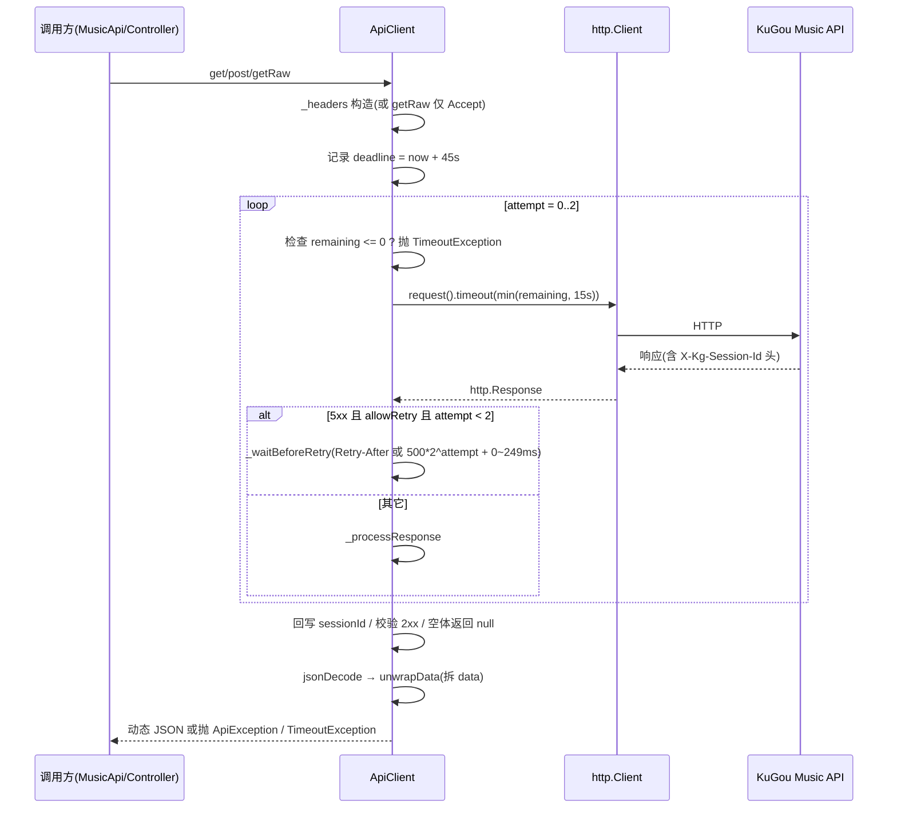

# 核心层 · ApiClient

> 文档编号：KA-03-01
> 级别：L2 📖
> 状态：现行
> 关联代码：lib/core/api_client.dart（168 行，主） + lib/config/app_config.dart、lib/services/music_api.dart、lib/main.dart
> 最近更新：2026-09-08
> 变更触发条件：改动重试次数/超时/退避策略/请求头构造/data 解包规则，替换 HTTP 客户端，新增非 KuGou 后端或新增 ApiClient 调用方时

---

## 1. 一句话结论（TL;DR）

ApiClient 是全项目**唯一的 HTTP 出口**，只有 3 个公开请求方法（`get` / `getRaw` / `post`），GET 可重试 2 次、POST 默认不重试。
所有鉴权状态（`token` / `t1` / `sessionId`）都挤在 2 个请求头上，其中 `token` 与 `sessionId` **共用同一个 `X-Kg-Session-Id`，后写的 `sessionId` 会覆盖 `token`**（`lib/core/api_client.dart:63-72`）。
响应统一走 `unwrapData` 自动拆 `data`，并且**任何响应头里的 `X-Kg-Session-Id` 都会静默回写本地会话**（`lib/core/api_client.dart:138-142`）。

---

## 2. 现状

### 2.1 类结构

| 元素 | 行号 | 说明 |
|---|---|---|
| `ApiException` | `lib/core/api_client.dart:9-17` | 唯一自定义异常，字段 `message` + `statusCode`（可空），`toString` 输出 `ApiException(<code>): <message>` |
| `ApiClient` | `lib/core/api_client.dart:19` | 构造函数可选注入 `http.Client`，缺省自建 `http.Client()` |
| `_client` | `lib/core/api_client.dart:22` | `package:http` 客户端实例，全 App 单例（`lib/main.dart:30`） |
| `token` | `lib/core/api_client.dart:23` | 可空，登录 token，写入 `X-Kg-Session-Id` |
| `t1` | `lib/core/api_client.dart:24` | 可空，写入 `t1` 头 |
| `sessionId` | `lib/core/api_client.dart:25` | 可空，后端会话键，写入 `X-Kg-Session-Id`（覆盖 `token`） |
| `get()` | `lib/core/api_client.dart:27-31` | 走 `AppConfig.apiUri`，带 `_headers`，`allowRetry` 恒为 true |
| `getRaw()` | `lib/core/api_client.dart:35-39` | 直接请求外部 `Uri`，只带 `Accept: application/json` |
| `post()` | `lib/core/api_client.dart:41-55` | 走 `AppConfig.apiUri`，带 `_headers`，body 为 `jsonEncode`，`allowRetry` 默认 false |
| `_headers` getter | `lib/core/api_client.dart:57-75` | 每次请求即时构造 |
| `_sendWithRetry()` | `lib/core/api_client.dart:78-118` | 重试 + 单次超时 + 总体 deadline |
| `_waitBeforeRetry()` | `lib/core/api_client.dart:120-135` | 指数退避 + 抖动 + `Retry-After` |
| `_processResponse()` | `lib/core/api_client.dart:138-155` | 回写 sessionId、状态码校验、JSON 解码 |
| `close()` | `lib/core/api_client.dart:157` | 关闭底层 client |
| `unwrapData()` | `lib/core/api_client.dart:160-168` | 顶层函数，拆 `data` |

### 2.2 装配与生命周期

| 事实 | 锚点 |
|---|---|
| 唯一实例在 `main()` 中创建，随后注入 `MusicApi` | `lib/main.dart:30-31` |
| 由 `_KaMusicAppState` 持有，App `dispose()` 时 `_client.close()` | `lib/main.dart:87`、`lib/main.dart:114` |
| 基址来自 `AppConfig.effectiveBaseUrl`（可被用户自定义覆盖） | `lib/config/app_config.dart:53`、`lib/config/app_config.dart:97-112` |
| 无拦截器、无日志、无缓存、无 cookie jar、无并发限制、无请求取消机制 | 全文件仅 168 行，无相关成员 |

### 2.3 依赖

| 依赖 | 用途 |
|---|---|
| `package:http` | 传输层（`get` / `post` / `ClientException`） |
| `dart:async` | `TimeoutException`、`Future` |
| `dart:convert` | `jsonEncode` / `jsonDecode` |
| `dart:math` | `Random().nextInt(250)` 抖动 |
| `../config/app_config.dart` | `AppConfig.apiUri` 拼 URL |

---

## 3. 设计说明

### 3.1 三个公开请求方法的差异

| 维度 | `get(path, [query])` | `getRaw(uri)` | `post(path, {query, body, allowRetry})` |
|---|---|---|---|
| 行号 | `api_client.dart:27-31` | `api_client.dart:35-39` | `api_client.dart:41-55` |
| URL 构造 | `AppConfig.apiUri(path, query)` | 调用方传入的完整 `Uri` | `AppConfig.apiUri(path, query)` |
| 请求头 | `_headers`（含鉴权头） | 仅 `Accept: application/json` | `_headers`（含鉴权头） |
| 请求体 | 无 | 无 | `body == null ? null : jsonEncode(body)` |
| `allowRetry` 默认 | 恒 true（不可配置） | 恒 true（不可配置） | **false** |
| 返回 | `unwrapData` 后的动态 JSON | 同左 | 同左 |
| 现有调用方 | 全部 KuGou 端点 | 仅网易云两步搜索 | 全部写操作 + 登录类 |
| 鉴权 | 带 `X-Kg-Session-Id` / `t1` | **不带任何鉴权头** | 带 |

> 注意：`query` 中值为 `null` 或空串的键会被丢弃（`lib/config/app_config.dart:106-110`），因此 `fmSongs` 传 `offset: -1` 时不会被丢弃（`-1` 的字符串非空）。

### 3.2 请求头构造（`_headers`，`api_client.dart:57-75`）

| 头 | 取值来源 | 是否总是存在 | 行号 |
|---|---|---|---|
| `Accept` | 常量 `application/json` | 是 | `58-61` |
| `Content-Type` | 常量 `application/json` | 是（GET 也发） | `58-61` |
| `X-Kg-Session-Id` | `token` | 仅 `token != null` | `63-66` |
| `t1` | `t1` | 仅 `t1 != null` | `67-69` |
| `X-Kg-Session-Id` | `sessionId` | 仅 `sessionId != null` | `70-72` |

写入顺序固定为 `token` → `t1` → `sessionId`，而 `token` 与 `sessionId` 是**同一个 header 名**，因此当两者同时非空时 **`sessionId` 胜出，`token` 被静默丢弃**（`api_client.dart:63-72`）。被注释掉的 `Authorization: Bearer` 说明历史上曾计划双头方案（`api_client.dart:64`）。

### 3.3 一次请求的完整生命周期

| 步骤 | 行为 | 锚点 |
|---|---|---|
| 1 | 调用方发起 `get` / `post` / `getRaw` | `27` / `41` / `35` |
| 2 | 构造 URL（`AppConfig.apiUri` 拼基址 + 路径 + 查询串） | `lib/config/app_config.dart:97-112` |
| 3 | 构造请求头（`get` / `post` 走 `_headers`；`getRaw` 仅 `Accept`） | `57-75` |
| 4 | 计算总体 deadline = 当前时间 + 45s | `85` |
| 5 | 循环最多 3 次（`attempt = 0,1,2`），每次先检查 deadline | `87-91` |
| 6 | 单次超时 = `min(剩余时间, 15s)` | `93-95` |
| 7 | 响应状态码 ∈ {500,502,503,504} 且可重试且还有次数 → 退避后重试 | `96-105` |
| 8 | 其余响应 → `_processResponse` 处理并返回 | `106` |
| 9 | `TimeoutException` / `ClientException` → 可重试则退避重试，否则原样抛出 | `107-112` |
| 10 | `FormatException` → 直接抛出，不重试 | `113-115` |
| 11 | `_processResponse`：回写 sessionId → 非 2xx 抛 `ApiException` → 空体返回 `null` → 解码并 `unwrapData` | `138-155` |
| 12 | `jsonDecode` 失败 → 返回**原始字符串**（不抛错） | `149-154` |

### 3.4 重试策略

| 参数 | 值 | 锚点 |
|---|---|---|
| `maxRetries` | 2（总尝试次数 3） | `api_client.dart:80` |
| 单次尝试超时 `attemptTimeout` | 15 秒 | `api_client.dart:83` |
| 总体 deadline `overallTimeout` | 45 秒 | `api_client.dart:84` |
| 退避基数 | `500 * (1 << attempt)` 毫秒 | `api_client.dart:126-127` |
| 抖动 | `Random().nextInt(250)` 毫秒（0~249） | `api_client.dart:129` |
| `Retry-After` 解析 | 仅支持整数秒；解析失败回落指数退避 | `api_client.dart:125-128` |
| `Retry-After` 钳制范围 | `clamp(0, 15000)` 毫秒 | `api_client.dart:128` |
| 退避上限 | 实际等待 `min(delay, 剩余 deadline)` | `api_client.dart:131-134` |

实际退避时长（无 `Retry-After` 时）：

| 第几次重试 | attempt | 基础等待 | 加上抖动后区间 |
|---|---|---|---|
| 第 1 次 | 0 | 500ms | 500~749ms |
| 第 2 次 | 1 | 1000ms | 1000~1249ms |

> `Retry-After` 只在拿到 `http.Response` 的路径生效（即 5xx 重试）；`TimeoutException` / `ClientException` 路径传入 `null`，永远走指数退避（`api_client.dart:103`、`109`、`112`）。
> deadline 耗尽时抛的是 `TimeoutException('API request deadline exceeded')`，**不是** `ApiException`（`api_client.dart:89-91`、`132-133`）。

### 3.5 错误分类与是否重试

| 情形 | 是否重试 | 最终表现 | 锚点 |
|---|---|---|---|
| `TimeoutException`（单次超时 / deadline 耗尽） | 是（未超次数且 allowRetry） | 抛出 `TimeoutException` | `107-109` |
| `http.ClientException`（连接失败、DNS、断网） | 是（未超次数且 allowRetry） | 抛出 `ClientException` | `110-112` |
| `FormatException` | **否**，立即抛出 | 抛出 `FormatException` | `113-115` |
| 状态码 500 / 502 / 503 / 504 | 是（allowRetry 为 true 时） | 重试耗尽后抛 `ApiException`（body 原文） | `96-105`、`143-145` |
| 状态码 429 | **否**（不在可重试集合） | 抛 `ApiException(429)` | `96-101`、`143-145` |
| 状态码 4xx（400/401/403/404…） | **否** | 抛 `ApiException(statusCode)`，`message` = 响应体原文 | `143-145` |
| 2xx 但 body 非 JSON | 不适用（已成功返回） | 返回原始字符串 | `149-154` |
| 2xx 但 body 为空 | 不适用 | 返回 `null` | `146-148` |
| 循环跑完未返回（理论分支） | — | 抛 `ApiException('请求失败，已重试 2 次')` | `117`（**实际不可达，见 `4.1 AC-04**） |

### 3.6 响应处理与 sessionId 自动提取

| 行为 | 规则 | 锚点 |
|---|---|---|
| 读取会话键 | 读响应头 `x-kg-session-id`（http 包已统一小写） | `api_client.dart:139` |
| 回写条件 | 值非 `null` 且非空串才覆盖 `sessionId` | `api_client.dart:140-142` |
| 状态码校验 | `statusCode < 200 || statusCode >= 300` 抛 `ApiException` | `api_client.dart:143-145` |
| 空体 | `body.trim().isEmpty` → `Future.value(null)` | `api_client.dart:146-148` |
| 解码 | `jsonDecode(body)` 后立刻 `unwrapData` | `api_client.dart:150-151` |
| 解码失败 | `FormatException` 被就地捕获，返回 body 原文 | `api_client.dart:152-154` |

> 该回写是「登录态能续上」的关键：扫码登录的 `LoginSession` 本身不带 `sessionId`，靠这里从登录响应头抓取（`lib/services/music_api.dart:28-37`、`lib/controllers/auth_controller.dart:295-297`）。

### 3.7 `unwrapData` 解包规则（`api_client.dart:160-168`）

| 输入形态 | 输出 |
|---|---|
| `Map<String, dynamic>` 且 `json['data'] != null` | 返回 `data` 的值 |
| `Map<String, dynamic>` 且无 `data` 键，或 `data` 为 `null` | 返回整个 map |
| `List` | 原样返回 |
| `String` / `num` / `bool` / `null` | 原样返回 |

> 只拆一层：若 `data` 内还有 `data`，第二层不会被继续拆（调用方 `MusicApi` 用 `asMap` 兜底，`lib/models/music_models.dart:1791-1799`）。

### 3.8 `allowRetry` 的实际取值

`post` 的 `allowRetry` 默认 `false`，且**全项目没有任何调用点显式传 true**（`grep allowRetry` 仅命中 `api_client.dart` 自身）。因此：

| 调用点 | 端点 | 方法 | `allowRetry` | 锚点 |
|---|---|---|---|---|
| `sendLoginCode` | `/captcha/sent` | POST | false | `lib/services/music_api.dart:42` |
| `loginWithPhone` | `/login/cellphone` | POST | false | `lib/services/music_api.dart:55` |
| `refreshToken` | `/login/token` | POST | false | `lib/services/music_api.dart:92` |
| `logout` | `/login/logout` | POST | false | `lib/services/music_api.dart:103` |
| `addListeningTime` | `/listen/timeadd` | POST | false | `lib/services/music_api.dart:297` |
| `createPlaylist` | `/playlist/create` | POST | false | `lib/services/music_api.dart:521` |
| `collectPlaylist` | `/playlist/add` | POST | false | `lib/services/music_api.dart:531` |
| `deletePlaylist` | `/playlist/del` | POST | false | `lib/services/music_api.dart:538` |
| `addSongsToPlaylist` | `/playlist/tracks/add` | POST | false | `lib/services/music_api.dart:547` |
| `removeSongsFromPlaylist` | `/playlist/tracks/del` | POST | false | `lib/services/music_api.dart:563` |

> 结论：**所有写操作（含登录、歌单增删、加收听时长）都不重试**；所有 GET 请求都重试。GET 中并非全部幂等，见 `4.1 AC-03。

---

## 4. 约束与坑

### 4.1 已知缺陷

| 编号 | 问题 | 锚点 | 影响 |
|---|---|---|---|
| AC-01 | `token` 与 `sessionId` 共用 `X-Kg-Session-Id`，后写的 `sessionId` 覆盖 `token`；两者语义无法区分 | `api_client.dart:63-72` | 若某次未登录响应的头里带回另一个会话键，会静默顶掉登录 token，后续请求全部失联 |
| AC-02 | 4xx（含 401/403）不重试、也不触发 token 刷新 | `api_client.dart:96-101`、`143-145` | 会话过期只能靠 `AuthController` 主动 `refreshToken`（`lib/controllers/auth_controller.dart:261-281`），业务调用会直接失败 |
| AC-03 | 领取类写操作使用 GET，超时后会被重试 | `lib/services/music_api.dart:287`（`/youth/day/vip`） | 可能重复调用领取接口；后端是否幂等**待核实**（`api.json` 描述为「领取当天 VIP，不可多领」） |
| AC-04 | `_sendWithRetry` 末尾的 `throw ApiException('请求失败，已重试 2 次')` 不可达 | `api_client.dart:117` | 死代码，误导排障（每次循环末次迭代都必然 return 或 throw） |
| AC-05 | `FormatException` 重试分支实际不可达：`jsonDecode` 的 `FormatException` 已被 `_processResponse` 吞掉 | `api_client.dart:113-115` vs `149-154` | 文档/代码意图不一致 |
| AC-06 | `getRaw` 不带 `_headers`，无 `X-Kg-Session-Id` / `t1` | `api_client.dart:37` | 网易云请求恒为匿名（当前符合预期，但无法复用登录态） |
| AC-07 | `Retry-After` 只解析整数秒，HTTP-date 形式被忽略 | `api_client.dart:125-128` | 服务端若返回日期格式，退避会退回指数策略 |
| AC-08 | 无请求取消机制（无 `CancelToken` / abort） | 全文件 | 切歌/离页时旧请求继续占用带宽，只能靠上层标志位忽略结果（如 `MusicApi.lyrics` 的 `isCancelled`） |
| AC-09 | 15s 超时只覆盖「发请求到读完响应体」，不覆盖 `jsonDecode` 与 `unwrapData` | `api_client.dart:93-95`、`149-154` | 超大响应体的解码耗时不受 deadline 约束 |
| AC-10 | `sessionId` 只存内存，不落盘 | `api_client.dart:25` | 重启后由 `AuthController.restore` 从 SharedPreferences 恢复（`lib/controllers/auth_controller.dart:196-208`） |
| AC-11 | 429 不重试、不看 `Retry-After` | `api_client.dart:96-101` | 被限流时直接抛错，无退避 |
| AC-12 | deadline 耗尽抛 `TimeoutException` 而非 `ApiException`，上层只 catch `ApiException` 会漏掉 | `api_client.dart:89-91`、`132-133`；`lib/controllers/auth_controller.dart:571-575` | 错误提示退化为 `TimeoutException after …` 原文 |
| AC-13 | `songUrl` 里 `debugPrint` 不受 `kDebugMode` 保护 | `lib/services/music_api.dart:479` | Release 版也会打印响应键（无害但污染日志） |

### 4.2 有意不做的事（D-06）

| 不做 | 说明 |
|---|---|
| 不缓存任何响应 | 缓存由调用方通过 `CacheService` 显式做，见 `../03-模块详解/服务层-缓存体系.md` |
| 不自动刷新 token | 刷新时机由 `AuthController` 决定 |
| 不做请求签名/加密 | 全部依赖后端 `X-Kg-Session-Id` / `t1` |
| 不做多后端路由 | 网易云由 `MusicApi.searchNetEaseSongs` 用 `getRaw` 直连 |
| 不做请求日志 | 只有 `MusicApi` 的调试打印 |
| 不做重试计数上报 | 无埋点 |

---

## 5. 待办与关联

| 关联文档 | 关系 |
|---|---|
| `../03-模块详解/服务层-MusicApi.md` | 唯一业务调用方，逐方法端点见该文 |
| `../04-数据与接口/API-契约总览.md` | 端点与鉴权契约 |
| `../04-数据与接口/本地存储与配置项清单.md` | `settings.custom_api_base_url` 影响基址 |
| `../06-质量保障/已知问题与技术债台账.md` | AC-01~AC-13 应登记 |
| `../02-架构设计/分层架构与依赖规则.md` | 核心层依赖规则 |

待办（候选，需与台账对齐）：

| 编号 | 事项 | 依据 |
|---|---|---|
| T-AC-1 | 明确 `token` 与 `sessionId` 的优先级策略（拆头或显式二选一），消除覆盖歧义 | AC-01 |
| T-AC-2 | 为 `post` 增加 `allowRetry` 显式白名单，或把领取类接口从 GET 改为 POST | AC-03 |
| T-AC-3 | 删除不可达分支，或补齐「循环退出」的真实语义 | AC-04 |
| T-AC-4 | 统一异常类型：把 `TimeoutException` 包成 `ApiException` | AC-12 |
| T-AC-5 | 补 `ApiClient` 单测（当前 `test/` 下 0 个用例涉及它） | `test/` 目录 |
